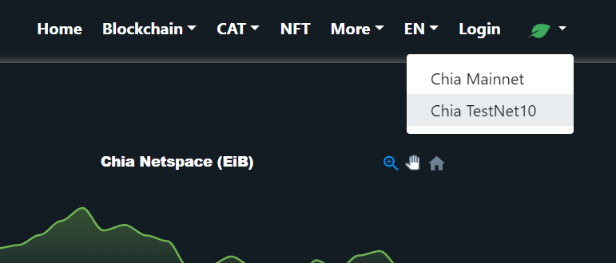
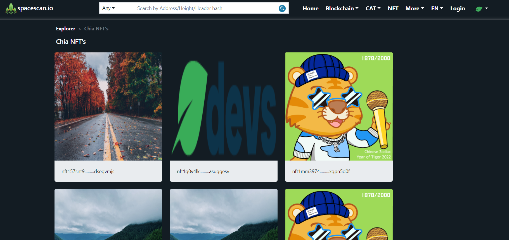

:::info For feedback
Spacescan.io is built on your feedback and suggestions. We want to provide continuous updates to the community and get feedback, so we can build the features which the community needs.
Hope you would like these Weekly updates and Join in our journey to build awesome tools for Chia!

[Discord](https://discord.gg/Bb4sj3Bg9P) [Twitter](https://twitter.com/spacescan_io) 

:::

## Completed
### 1. NFT0 support in Testnet 10
Chia has recently released its [vision for NFT](https://www.chia.net/2022/05/11/our-vision-for-chia-nfts.en.html) with [developer guide to mint](https://docs.chia.net/docs/15resources/nft_dev_guide/) the NFT using the command line.

Chia released the NFT0 standard which is the draft testnet version of the full NFT1 version planned to be released soon. This NFT0 is recommended to be minted only in Testnet 10 and a lot of community NFT projects are testing this feature. Within a week of standard release we have added Chia NFT support for testnet 10.

You can visit the Testnet chia NFT page here 
https://www.spacescan.io/txch10/nfts

OR

Step 1. Select Testnet 10 menu in right top and click NFT to view the NFT minted in Testnet 10.

Step 2.  Click NFT menu at top to view Chia NFT minted on Testnet 10

### 2. Dixie Integration for CAT trading

Most loved Dexie exchange integration with CAT is up now!
you can directly click on Dexie icon from CAT summary page to land on Dixie page to Trade CATs!

- Link to view -> [Chia Cat token for USDS]( https://www.spacescan.io/xch/cat1/6d95dae356e32a71db5ddcb42224754a02524c615c5fc35f568c2af04774e589)
- The link directly would land user in Dexie trading pair for USDS/XCH [Dexie page](https://dexie.space/offers/6d95dae356e32a71db5ddcb42224754a02524c615c5fc35f568c2af04774e589/xch)

## In progress
### 1. Chia NFT 1 support
- We are working on below listed items to support NFT1 standards which is going to be released by Chia soon™
    - Top menu to view Stats, Ranks, explore and Transfers of NFT in both testnet 10 and Mainnet
    - Ability to view NFT metadata
    - Ability to view NFT based on collections 
    - Enhance top search option to support NFT
    - Create NFT API so community developers could use it to build tools

### 2. Improve Stability of parser engine
- We have re-written our parser engine for the third time to bring more stability in our sync process and to support new type of wallets like CAT, NFT, DID and RL. There are multiple bug reports in our discord channel on the difference of wallet balance. We would continue working on hardening our parser engine to provide stable wallet balance.

### 3. Enhanced Seach box
- Now spacescan supports multiple wallet types like xch, CAT and NFT. so we need to enhance our search box to support these new asset types.

Note:
We really love [Hash.green](https://docs.hash.green/blog) teams weekly updates. We feel this is a wonderful way to get feedback and commit ourselves to a timeline ( which is really hard :sweat: ) . Thanks to the Hash.green team for the inspiration.