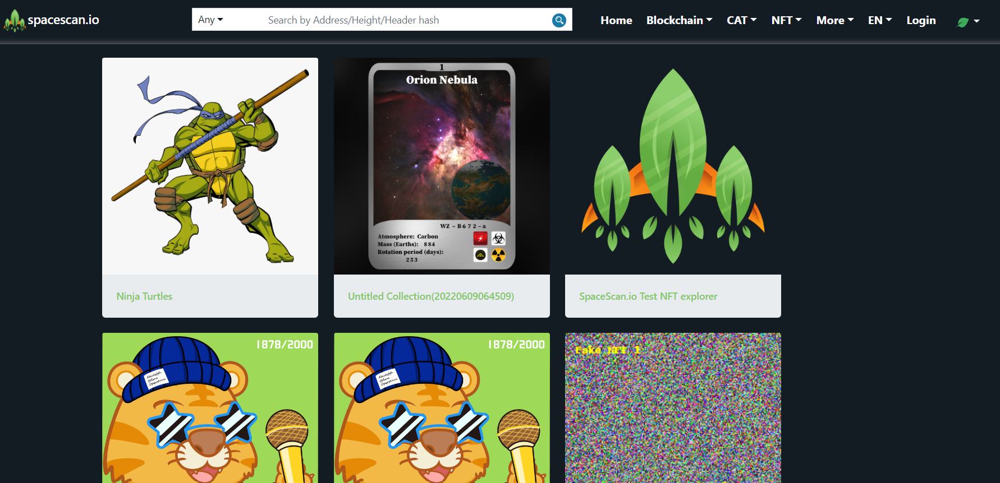

:::info For feedback
Spacescan.io is built on your feedbacks and suggestions. Now, We are at a point that needs your support to continue our journey. Please donate XCH/CAT towards our dev funds in [support us page](https://www.spacescan.io/xch/support-us).   Join in our journey to build awesome tools for Chia ->
[Discord](https://discord.gg/Bb4sj3Bg9P)  [Twitter](https://twitter.com/spacescan_io)

:::
## Completed
### 1. Chia NFT 1 enhancements
We have enhanced support for NFT with below informations inorder to support the upcoming Chia NFT 1 standard.
- Top menu to view Stats, Ranks and Transfers of NFT in both testnet 10 and Mainnet
- Create NFT API for community developers to build tools
- Support for other NFT types like base64 encoded images

Check out the NFT collections in Testnet 10 :link: https://www.spacescan.io/txch10/nft/collections

Chia would release the finalized NFT 1 soon and our current implementation also would be modified to support the finalized NFT1 version.

:::note Developer
- [JagRudh](https://twitter.com/JagRudhChia) received 0.5 XCH and Its sponsored by [Ultimate Farmers Club](https://twitter.com/TheHonestFarm)
- [Sham](https://twitter.com/shamhiruthik) received 0.25 XCH and Its sponsored by [Ultimate Farmers Club](https://twitter.com/TheHonestFarm)
:::

### 2. Enhance Search box
- Now spacescan supports multiple wallet types like xch, CAT and NFT.Enhanced to support most of the 

:::note Developer
- [NK](https://twitter.com/nandhakumar1033) received 0.5 XCH and Its sponsored by [Ultimate Farmers Club](https://twitter.com/TheHonestFarm)
- [JagRudh](https://twitter.com/JagRudhChia) received 0.5 XCH and Its sponsored by [Ultimate Farmers Club](https://twitter.com/TheHonestFarm)
:::

### 3. Enhance CAT features
- Top menu to view Stats, Ranks, explore and Transfers of CAT in both testnet 10 and Mainnet
    - Price info integration from [Dexie](https://dexie.space/markets) and [hash.green](https://hash.green/dex/XCH-USDS)
- Fix the issues in CAT API and make it stable with new routes

:::note Developer
 [Ajay](https://twitter.com/JagRudhChia) received 0.5 XCH and Its sponsored by [Ultimate Farmers Club](https://twitter.com/TheHonestFarm)
:::

## In progress
### 1. Chia NFT 1 support
- We are working on below listed items to support NFT1 standards which is going to be released by Chia soon™
    - Trade integration with NFT market places and exchanges like Dexie.space and Mintgarden.io
    - Enhance top search option to support NFT
    - Enhancing the assets load time by storing images in spacescan.io
    - DID based authenticity mark to avoid impersonation scams in NFT
    - Rarity calculator 

> Developer - [JagRudh](https://twitter.com/JagRudhChia)

### 2. Enhance Search box
- Enhance search with option to search NFTS with below attributes
    - NFT1
    - Collection id
    - NFT name
    - NFT collection  name
    - NFT traits

> Developer - [NK](https://twitter.com/nandhakumar1033)

### 3. Enhance CAT features
- We are working on below listed items for CAT1 standard to provide better discoverability of CATs
    - DID based authenticity mark to avoid impersonation scams in CAT
    - Fix the issues in CAT API and make it stable with new routes

> Developer - [Ajay](https://twitter.com/JagRudhChia)
