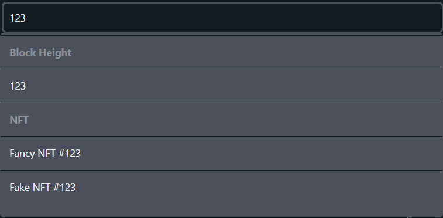
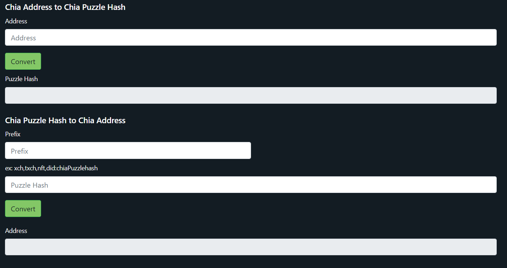

:::info Support us
Spacescan.io is built on your feedbacks and suggestions. Please donate XCH/CAT towards our dev funds and it will be used as a feature bounty -> [support us page](https://www.spacescan.io/xch/support-us).   Join in our journey to build awesome tools for Chia ->
[Discord](https://discord.gg/Bb4sj3Bg9P)  [Twitter](https://twitter.com/spacescan_io) [Github](https://github.com/spacescan-io)

:::
## Completed
### 1. Enhance Search box 
- Enhancing search with option to search XCH, CAT and NFT with below attributes
    - NFT ID, Name, Collection ID and Collection Name
    - CAT Asset ID, Name and Symbol
    - Address, Header Hash, Coin ID and Blocks
  

:::note Developer
- [JagRudh](https://twitter.com/JagRudhChia)
- [NK](https://twitter.com/nandhakumar1033) received 0.5 XCH from Dev Fund
:::

### 2. Timescale Extension
- Extended Timescale for charts to view transactions for all.

:::note Developer
- [Sham](https://twitter.com/shamhiruthik) received 0.25 XCH from Dev Fund
:::

### 3. Enhance CAT features
- Enhanced Top menu with Stats, Ranks, explore and Transfers features for CAT in both Mainnet and testnet 10 

> Developer - [Ajay](https://twitter.com/JagRudhChia)

### 4. Tools
- We have Added support for Puzzle hash Converter for XCH, Txch, NFT and DID -> [Tools](https://www.spacescan.io/xch/tools/puzzlehashconvertor)

:::note Developer
- [NK](https://twitter.com/nandhakumar1033) received 0.25 XCH from Dev Fund
:::

## In progress
### 1. Chia NFT 1 support
- We are working on below listed items to support NFT1 standards which is going to be released by Chia soon™
    - Creation of Ranks and Transfers page for NFT in both Mainnet and Testnet
    - Trade integration with NFT market places and exchanges like Dexie.space and Mintgarden.io
    - Enhancing the assets load time by storing images in spacescan.io
    - DID based authenticity mark to avoid impersonation scams in NFT
    - Rarity calculator
    - Ability to search NFT based on traits 

> Developer - [JagRudh](https://twitter.com/JagRudhChia)

### 2. Enhance CAT features
- We are working on below listed items for CAT1 standard to provide better discoverability of CATs
    - DID based authenticity mark to avoid impersonation scams in CAT
    - Fix the issues in CAT API and make it stable with new routes
  
> Developer - [Ajay](https://twitter.com/JagRudhChia)

### 3. Enhance API 
- Enhance public API with time frame for Netspace and price  

> Developer - [Ajay](https://twitter.com/)

### 4. User Guide
- Creating User Guide for various Chia features and functionalities 

> Developer - [Sham](https://twitter.com/shamhiruthik)

### 5. Read Only Mobile App
- Creating Read Only Moile App to View Chia Tokens and Transactions

> Developer - [Ibrahim](https://twitter.com/)

### 6. Coins Traceability
- Ability to trace the Coins Parent,Child and Sibling information

> Developer - [NK](https://twitter.com/nandhakumar1033)

### 7. CAT Holders Info
- Provide  Unique Holders of CAT in CAT/summarypage

> Developer - [AjayZorro](https://twitter.com/)
