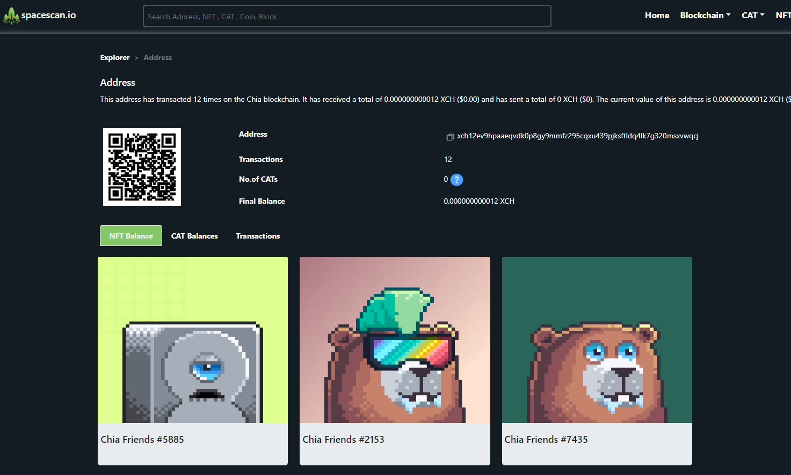
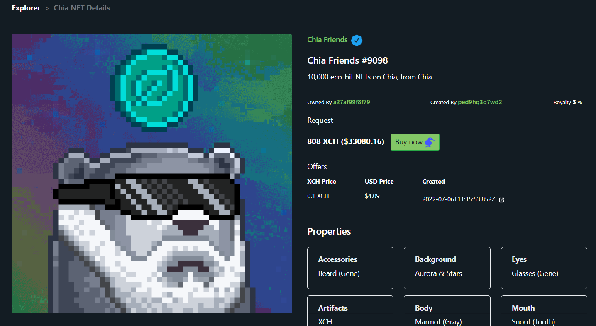

:::info Support us
Spacescan.io is built on your feedbacks and suggestions, Join us [Discord](https://discord.gg/Bb4sj3Bg9P)  [Twitter](https://twitter.com/spacescan_io) [Github](https://github.com/spacescan-io). Show your love by sending XCH, NFT and CAT to dev funds [support us page](https://www.spacescan.io/xch/support-us).
:::

## Completed
### 1. Chia NFT 1 features
- Search bar will show only verified nfts based on name in search results
- Check your NFT collections along with CAT and XCH balance for your address

https://www.spacescan.io/xch/address/xch12ev9hpaaeqvdk0p8gy9mmfz295cqxu439pjksftldq4lk7g320msxvwqcj

> Developer - [Ajay](https://twitter.com/AjayBenadict)

- Offer Trade integration with NFT market [dexie.space](https://dexie.space/)

https://www.spacescan.io/xch/nft/nft1k9c4cwmyctwzf57xzfaaghm20erdz23wzz3jsg0uwyft7qx5eeeqq4n93s

> Developer - [JagRudh](https://twitter.com/JagRudhChia)

### 2. Coins Traceability
- Ability to trace the Coins Parent, Child and Sibling information

https://www.spacescan.io/xch/coin/0xf187ed71c3643a29fa52f0bbb6b25da09d5ad0f576fdcf5938307b2657841a2d

> Developer - [NK](https://twitter.com/nandhakumar1033)

## In progress
### 1. Chia NFT 1 support
- We are working on below listed items to support NFT1 standards which is going to be released by Chia soon™
    - Creation of Ranks for NFT in both Mainnet and Testnet
    - Enhancing the assets load time by storing images in spacescan.io
    - Rarity calculator
    - Ability to search NFT based on traits 
    - DID profiles and ownership of assets

> Developer - [JagRudh](https://twitter.com/JagRudhChia)

### 2. XCH rich list
- Jon from [chialinks.com](https://chialinks.com/) created a feature bounty in [github](https://github.com/spacescan-io/web/issues/54) with [3.14 XCH](https://www.spacescan.io/xch/coin/0x771cde950b235e9513c66a3542865cf70587417adf529be8c42485040e4d4191)
> Developer - [Sham](https://twitter.com/shamhiruthik) / [NK](https://twitter.com/nandhakumar1033)
### 2. Enhance CAT features
- We are working on below listed items for CAT1 standard to provide better discoverability of CATs
    - Fix the issues in CAT API and make it stable with new routes
  
> Developer - [Ajay](https://twitter.com/AjayBenadict)

### 3. Enhance API 
- Enhance public API with time frame for Netspace and price  

> Developer - [Ajay](https://twitter.com/AjayBenadict)

### 4. User Guide
- Creating User Guide for various Chia features and functionalities 

> Developer - [Sham](https://twitter.com/shamhiruthik)