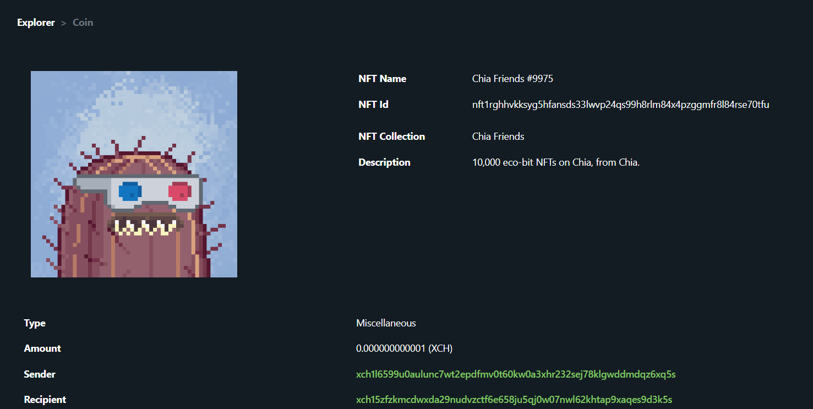

:::info Support us
Spacescan.io is built on your feedbacks and suggestions, Join us [Discord](https://discord.gg/Bb4sj3Bg9P)  [Twitter](https://twitter.com/spacescan_io) [Github](https://github.com/spacescan-io). Show your love by sending XCH, NFT and CAT to dev fund [support us page](https://www.spacescan.io/xch/support-us).
:::

## Completed
### 1. Chia NFT 1 features
 - Spacescan now host optimized images for all NFT to improve user experience. We noticed creators have issues in hosting images and  resulted in not so good experience for Mobile users. This would provide equal space for all creators and users.
 - Shows NFT with valid hash match for preventing scam projects
 - Validates Meta json with CHIA [CHIP-0007 scehma](https://github.com/Chia-Network/chips/blob/metadata-schema/CHIPs/chip-will-riches-metadata.md)

  

> Developer - [JagRudh](https://twitter.com/JagRudhChia)/[natsabari](https://twitter.com/natsaba)

### 2. NFT coins
- Enhancement in Coin page is done to show details like name, id, collections, description along with coin basic information

 
> Developer - [Ajay](https://twitter.com/AjayBenadict)

## In progress
### 1. Chia NFT 1 support
- We are working on below listed items to support NFT1 standards
    - Rank for NFTs
    - Rarity calculator
    - Ability to search NFT based on traits 

> Developer - [JagRudh](https://twitter.com/JagRudhChia)

### 2. XCH rich list
- Jon from [chialinks.com](https://chialinks.com/) created a feature bounty in [github](https://github.com/spacescan-io/web/issues/54) with [3.14 XCH](https://www.spacescan.io/xch/coin/0x771cde950b235e9513c66a3542865cf70587417adf529be8c42485040e4d4191) 
> Developer - [Sham](https://twitter.com/shamhiruthik) / [NK](https://twitter.com/nandhakumar1033)
### 2. Enhance CAT features
- We are working on below listed items for CAT1 standard to provide better discoverability of CATs
    - Fix the issues in CAT API and make it stable with new routes
  
> Developer - [Ajay](https://twitter.com/AjayBenadict)

### 3. Enhance API 
- Enhance public API with time frame for Netspace and price  

> Developer - [Ajay](https://twitter.com/AjayBenadict)

### 4. User Guide
- Creating User Guide for various Chia features and functionalities 

> Developer - [Sham](https://twitter.com/shamhiruthik)