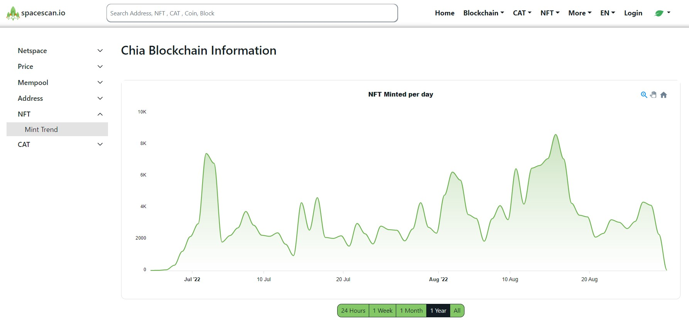

:::info Join Us
Spacescan.io is built on your feedbacks and suggestions, Join us [Discord](https://discord.gg/Bb4sj3Bg9P)  [Twitter](https://twitter.com/spacescan_io) [Github](https://github.com/spacescan-io).

:::
## Completed
### 1. Personalized collection urls
- Based on creator's feedbacks, now you can set personalized collection urls.
This will be collections home page and more exciting features coming soon.
Creators could get those new features and choose custom urls for donation of 3XCH towards our dev funds.
https://www.spacescan.io/collection/Chia_Friends

> Developer - [JagRudh](https://twitter.com/JagRudhChia)

### 2. New Insight Charts
- NFT Mint-Trend chart is added.

> Developer - [Sham](https://twitter.com/shamhiruthik)

- Existing CAT charts are moved to insights.

> Developer - [NK](https://twitter.com/nandhakumar1033)

## In progress
### 1. Chia NFT 1 support
- Rank for NFT
- NFT price details from settled offers
- Rarity calculator
- NFT price and trade details from 

> Developer - [JagRudh](https://twitter.com/JagRudhChia)/[natsabari](https://twitter.com/natsaba)

### 2. User Guide
- Creating a User Guide for various Chia features and functionalities 

> Developer - [Logesh](https://twitter.com/Logeshn1812) / [Sham](https://twitter.com/shamhiruthik) 
