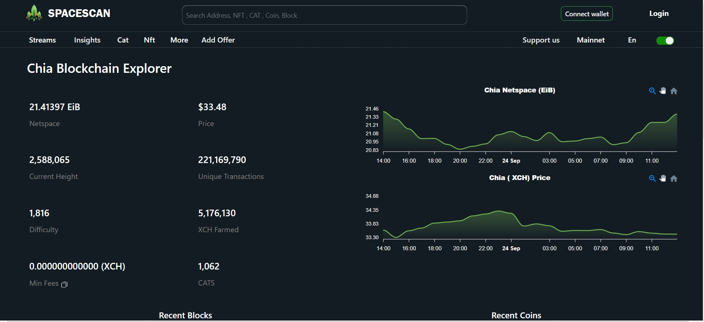
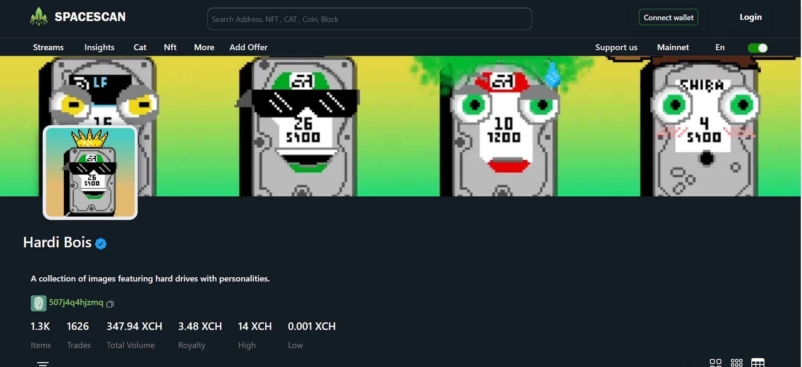

:::info Join Us
Spacescan.io is built on your feedbacks and suggestions, Join us [Discord](https://discord.gg/Bb4sj3Bg9P)  [Twitter](https://twitter.com/spacescan_io) [Github](https://github.com/spacescan-io).

:::
## Completed
### 1. Updation of Home Page
- Based on creator's feedbacks,there's some change done in style and view of the Home page.
  This will give a new fresh look to the website.
 
  

  > Developer - [ajayZorro](https://twitter.com/@AjayBenadict)

### 2. Additional details for collection page
- In collections page,total volume,trade,royalty,high and low price from offer settling chain are displayed.

  

  > Developer - [JagRudh](https://twitter.com/JagRudhChia)
