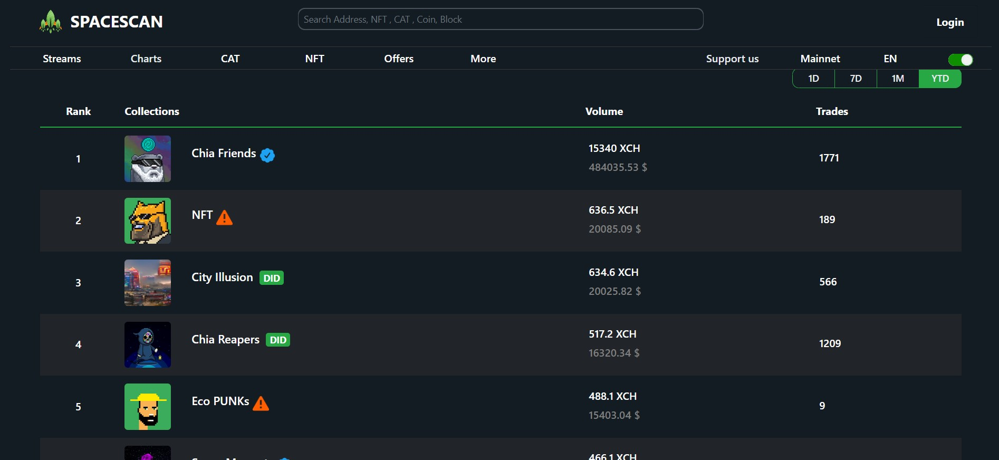
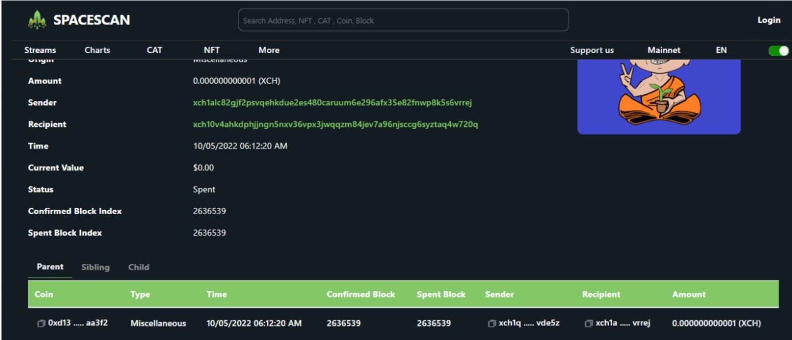

:::info Join Us
Spacescan.io is built on your feedbacks and suggestions, Join us [Discord](https://discord.gg/Bb4sj3Bg9P)  [Twitter](https://twitter.com/spacescan_io) [Github](https://github.com/spacescan-io).

:::
## Completed
### 1. Top chia NFT collections
- The top collections generated from both private and the public offers settled on chain across nft market places.
  
  

  > Developer -[ajayZorro](https://twitter.com/@AjayBenadict)

### 2. Nft collection details
- Now the collections page has enhanced to provide trades, total volume , royality, high and low settled offers on chain.

 

  > Developer -[ajayZorro](https://twitter.com/@AjayBenadict)

### 3. It is easy to read Mojo
- To enhance readability lower denominated xch will be automatically shown in mojos.
 

  

  > Developer - [aaron](https://twitter.com/flamingxod)

### 4. Fixes for confirmed and spend block
- Now parent, sibiling, child shows confirmed and spent block numbers.

  > Developer - [gautham](https://twitter.com/Gautham14764017?t=0YfoLc9jDvxT-fuVmRBJzA&s=09)

