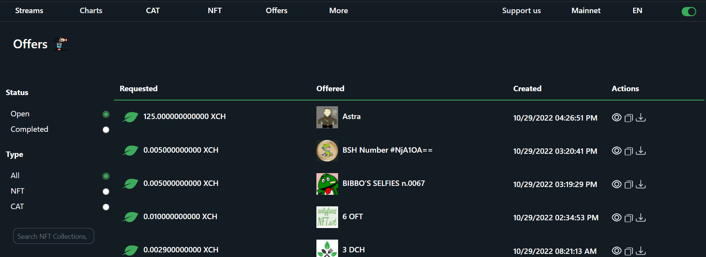
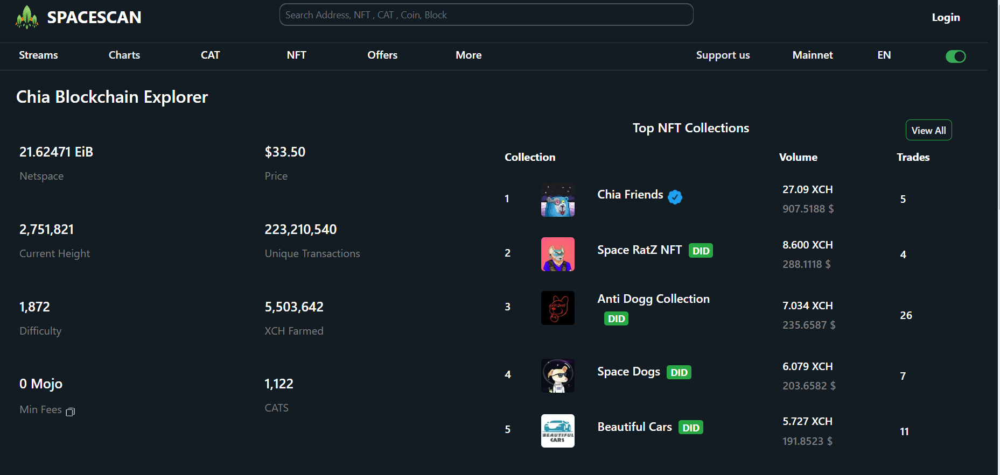

:::info Join Us
Spacescan.io is built on your feedbacks and suggestions, Join us [Discord](https://discord.gg/Bb4sj3Bg9P)  [Twitter](https://twitter.com/spacescan_io) [Github](https://github.com/spacescan-io).

:::
## Completed
### 1. NFT trade trends
- Get deep insights on NFT trade counts, volume and royalty from both private and public offers settled across market places.
  https://www.spacescan.io/xch/insight/nft-volume
  
  https://www.spacescan.io/xch/insight/nft-trade
  

  > Developer - [NK](https://twitter.com/nandhakumar1033)

### 2. CAT trade trends
- Get deep insights on CAT trade counts, volume from both private and public offers settled across market places.
  https://www.spacescan.io/xch/insight/cat-volume
 

  > Developer - [NK](https://twitter.com/nandhakumar1033)

### 4. Offers
- Our attempt to bring one more option to chia community to discover and trade NFT/CAT assets.
- This is in very early development stage, and we will work on this offers in upcoming weeks based on your feedbacks. 

  

  >  Developer - [JagRudh](https://twitter.com/JagRudhChia)

### 5. Coins filter
- Now you could filter recent coins based on coins type like CAT, NFT and DID

 

  > Developer - [NK](https://twitter.com/nandhakumar1033)

### 6. Top NFT collections in home
- The list of top 5 NFT collections tarded in past 24 hours would be shown in home page
- The Netspace and price charts could be accessed from Charts tab menu

 

 > Developer -[ajayZorro](https://twitter.com/@AjayBenadict)