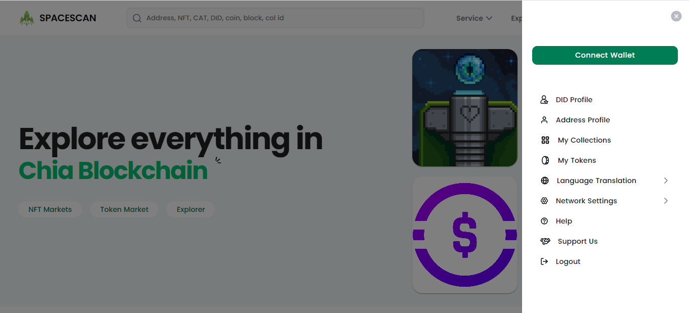
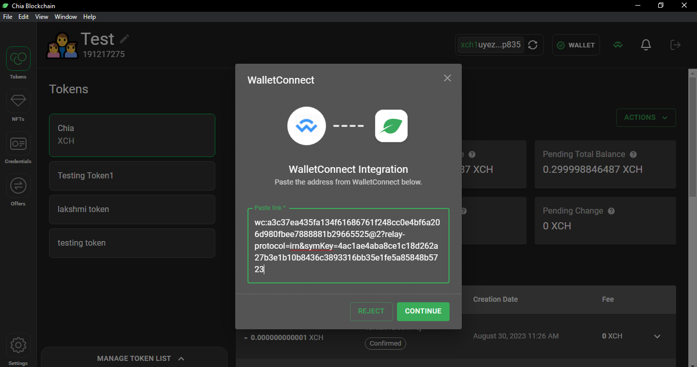

# My collection

We are excited to introduce the new Chia "My collection" in Spacescan. This guide will walk you through the process of setting up a Chia My collection using wallet connect. This process will enable the user to customize their NFT collection to be securely managed and shared with others on the Chia community. 

** This feature still in Beta so expect some glitches. [Reach team here for support](https://www.spacescan.io/contact-us) **

### 1) To access the "My collection"

Two way to access the "My collection" page.

i) Go to this link [**spacescan.io**](https://www.spacescan.io/mycollections)

ii)click on the profile icon,then click the "My collection"

### 2)  Connect wallet to import the Collection
Connect the wallet before edit/update the Collection.If wallet already connected ,please skip this step and reach to the next step.

Click connect wallet.

Copy the QR code.

Move to the Chia Wallet,click the wallet connect symbol then click the "Add connection" 

Paste(ctrl+v) the copied link in the given area.

Choose the wallet.

### 3) Import the Collection
After wallet connect,Move to spacescan.io click the "Import collection"

Enter the "Collection ID" in the text box to import.

Click import collection button,It will show the pop up to confirm the message in the chia wallet.

Go to the chia wallet and click confirm

### 4) Customize your collection
After import the collection,the page will land in the edit page to customize the collection details.

### 5)Public view of the collection

After done your edit ,user can see the imported collection.Just click on that .to see the public view of your collection.

