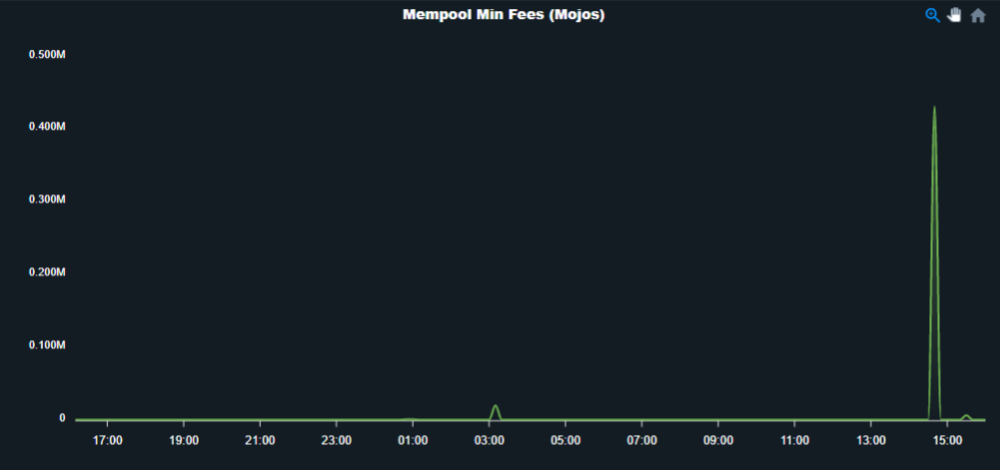

# Mempool

- A memory pool is simply a "waiting room" that holds the unconfirmed
transactions.

- One of the most prominent uses of the Mempool is to get pending
transactions.

- When a node receives a transaction, it will propagate the transaction to
peer nodes until a farmer approves the transaction and adds it to a new
block.

- As the transaction move from mempool to the farmers, they are sorted and
processed according to profitability.

## 1. Mem size

- It is the number of transactions in mempool to,that is to be processed.

- A high mempool size indicates more network traffic which result in higher
priority fees.

## 2. Mem fee 

- It shows how much people paying for the transaction.

- If mempool is not full, It will accept all transactions regardless of fees.

## 3. Min fee

- It is the minimum relay fee for the mempool when the mempool gets too
big.

- When mempool becomes full it will start rejecting or it will not accept any
more transactions.

## 4. Addition  

- It is the total number of mempool added to the queue.

- After a new block added to the blockchain, all full nodes check out the coins
that are spent and remove them from mempool.

