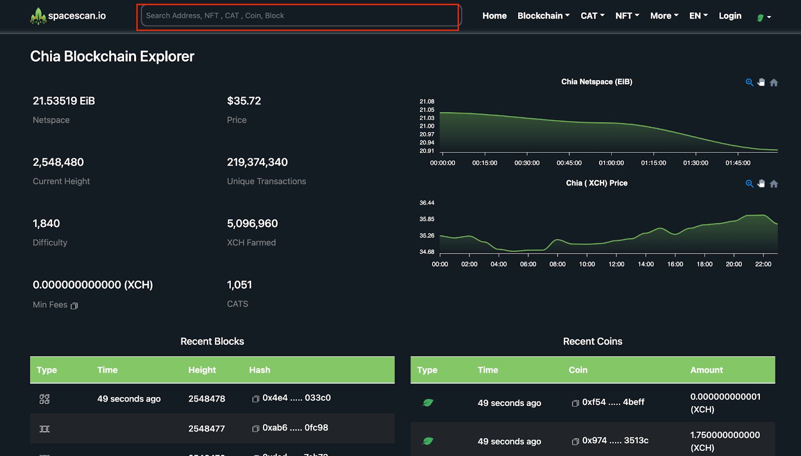
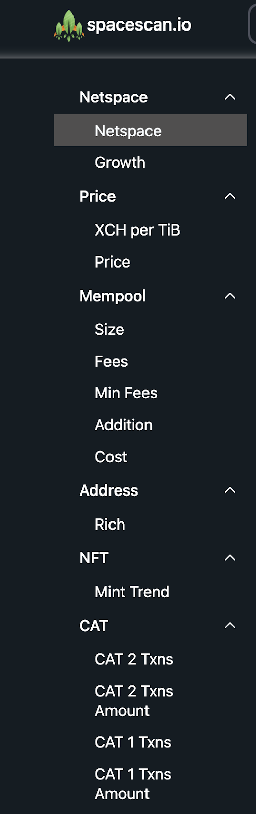
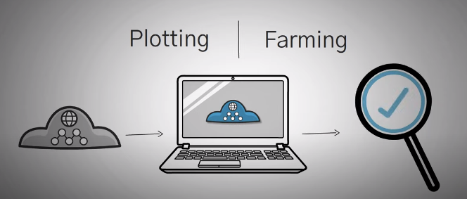
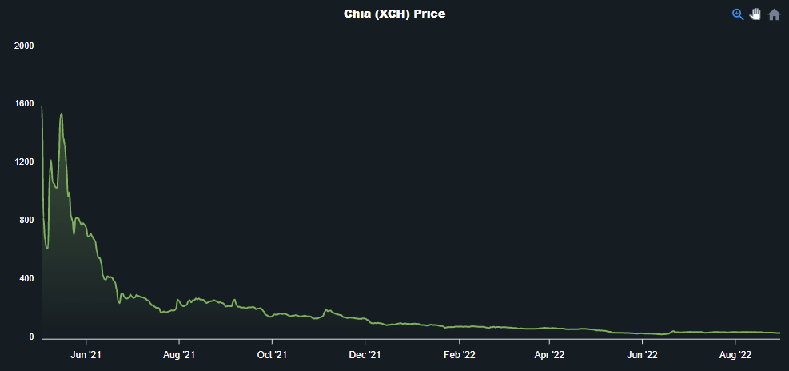

******Spacescan.io Guide**
 **What Is A Spacescan.io? How does it work?**Spacescan is a Blockchain Explorer on Chia. Blockchain explorer? At first hearing this term I think anyone will have a series of questions in their mind. What is a blockchain Explorer? 
Spacescan.io is a blockchain expolorer and analytics platform that gives you access to detailed information about all pending or confirmed blockchain transactions, , such as search transaction history, details of a block, current chain height, etc. You can also check the balance or transaction details by wallet address or transaction ID. Spacescan.io is the most trusted tool for exploring all public data on Chia, and it's free to use.
Spacescan started by three friends as a hobby, later on the interest in the chia explorer developed the organization and the result is now the number one chia explorer.The founders started as a farmer with just 100TB. Once it is grown to 300TB, he realized playing game is not going to have any use in future.The introduction to chia happened through twitter. Firstly, they started on with chia to the moon project. By getting more followers on it they planned for building this start-up.**Main aim: To bring a Glass node level of information to chia and to build a tool which is accessible for all other developers.**

**How to use spacescan.io?**
For the general user, the transaction information is usually confirmed through the blockchain explorer.
On spacescan.io, you can search for the wallet address to find out the balance, and all the transfer records of that address.
By searching the hash value of a transaction, you can check the specific information of a transaction, such as the timestamp, the fee of the transfer, block rewards, plot, etc.
The following is a brief tutorial of how to use spacesca.io.

**Search function:**

**Step 1:** Go to the Spacescan home page and look for the search box at the top of the page.Enter the hash or the wallet address to be directed to the transaction history details.

**Step 2:** Next, copy and paste the hash into the search box and press the search icon.

**Step 3:** It will displays full details of the particular transaction.

This interface contains information about the farmer Address and Hash, the number of tokens transferred, fees and the Date & Time etc.

In addition, you can find more information about CAT and NFT, etc. in the upper right hand side of the home page.

**Spacescan provides those information and insight to users:**

**Daily XCH per TiB**Chia blockchain (XCH) Daily XCH per TiB Chart shows the expected daily farmed XCH per TiB, All data is real-time, accurate and pulled directly from Chia.A tebibyte (TiB) is a unit of measurement in computers and similar electronic devices.Tebibytes hold 1024 gibibytes (GiB) or 1,099,511,627,776 bytes. Some people incorrectly call this number of bytes a terabyte, which is actually one trillion bytes, or 1000 gigabytes (GB). 1024 tebibytes make one pebibyte.Chia prices changes daily with 24 hour trading volume.(Ex). The live Chia price today is $36.11 USD with a 24-hour trading volume of $4,502,673 USD. Chia is down 0.32% in the last 24 hours.                 
**Chia Price**Chia there are two main processes PlottingFarming Plotting is essentially putting data on storage that you have own.Farming is checking that you still have it on that storage device.                     
**Plotting**Plotting is process of putting a bunch of data on a hard drive.Essentially you were doing a ton of math and filling up a bunch of ones and zeroes on a hard drive.During this calculation process you could use a hard drive disk it would be very inefficient.This process most people use an SSD as it will create the finalized plots the fastest.
**Farming**Farming is the process of having the network check that you did the work to store the ones and zeroes on those drives.Farming in terms of chia is just letting that plot sit there you don’t have to do anything else to it and it doesn’t require much up keep.Farming is that you farm on a hard drive these hard drive discs are usually slow older pieces of technology that are much more affordable in comparison to the newer solid state drives.
**Profitability** 8 terabyte hard drive which costs roughly around 200 dollars right now can earn roughly 0.73 chia a month.The network size is 2.9 EiB now if you sold those chia at today’s market price you would earn 809 dollars per month.As the network grows and more people join it this profit rate will go down the price of chia may rise or plummet.
         
**Netspace** This graph shows the space in EiB dedicated to farming Chia. It is an indicator of the competitiveness to find a block.An exbibyte (EiB) is a unit used to measure data storage capacity.The data for this graph is taken directly from the blockchain, every 10 minuites for the 1 day and 1 week graphs, and every 2 hours for the 1 month and 3 month graphs, 24 hours for the 1 year graphs.

**More about Spacescan.io**
Firstly, the spacescan is a small team, and the all activities regarding it is done during free time and by weekends. But now the team is grown quite big, with few interns on board.Now we follow Agile technology of having a meet on every Tuesday-Friday discussing on various aspects on which the members working on.Our design starts with a symbol like xch, dxch that makes us to support main as well as the test net. From Url,node,Tb,etc, everything has a symbol. This is made us to make fork easy for us. Since each section deals with many transactions, charts thereby it needed many level filtration to get a final form. Henceforth, the capacity increased with less time.Our website features dark mode so that it will be feasible for the users.Users can change the view mode from Dark/White through the option given at the top.Our chia chain is different from others as we have a price as well as a netspace with high level of information provided. List of coins and blocks can be viewed on the home page. From the recent coins to xch, cat transactions are differentiation are also shown.Chia main net explorer is kept as main net explorer as it needed to get opened for developer.

