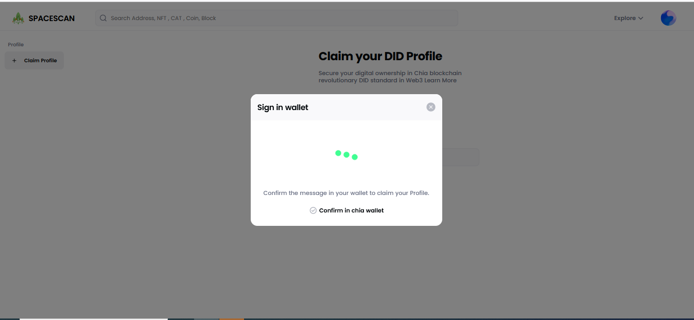
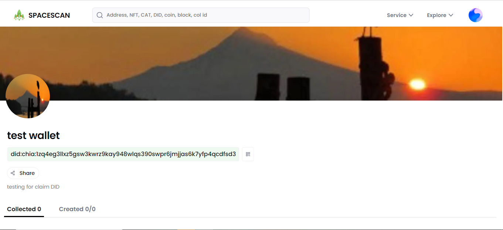

# Chia DID profile

 We are excited to introduce the new Chia DID profile in Spacescan. This guide will walk you through the process of setting up a Chia DID profile using wallet connect. This process will enable the digital identity to be securely managed and shared with others on the Chia community. 

** This feature still in Beta so expect some glitches. [Reach team here for support](https://www.spacescan.io/contact-us) **

### 1) Two ways to reach the claim DID 
i) Go to [**myprofile in spacescan.io**](https://www.spacescan.io/myprofile) 

ii) select My profile icon in the top right corner of spacescan.io ,then click DID profile

Click "connect wallet"

then Popup shows QR code ,click "copy to clipboard"

### 2) Connect Chia wallet with Spacescan.io
If wallet already connected, skip the step:2 jump to step:3
 Copy the QR code

Open the chia wallet click "Add connection"

Paste (ctrl+v) the copied code

Choose the wallet
   

### 3) Create DID profile in chia wallet
If DID already created then jump to step:4
Open the chia wallet,select settings then move to the PROFILES(DID) tab,click create profile(+).Enter the name of the DID and select the fee,hit the create button.

Now you can see the created DID,Copy the DID to claim in spacescan.io

### 4) Move to [**spacescan.io**](https://www.spacescan.io/myprofile) to claim the created DID
Click "Add DID profile"

Paste the DID that you were copied from chia wallet
Sign in message will pop up

Confirm the DID in chia wallet

### 5) Move to spacescan.io to Edit and customize the DID

User will land in the Edit page of claimed DID.You can customize the details.

### 6) Claimed DID
After edit the DID details,You can see the claimed DID.

To view of your DID just click on the DID or select "View address" from the meat ball menu icon

       
       