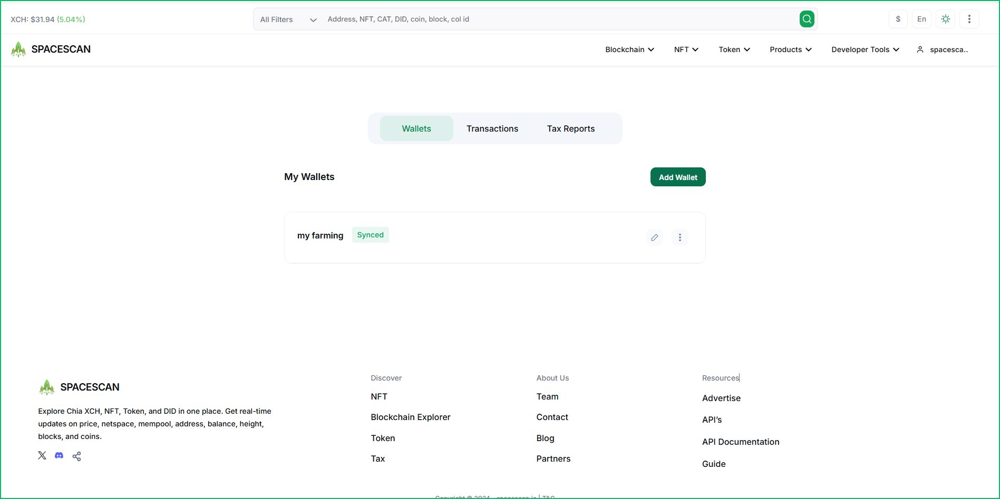
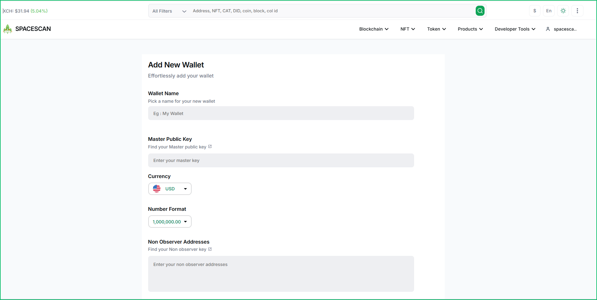
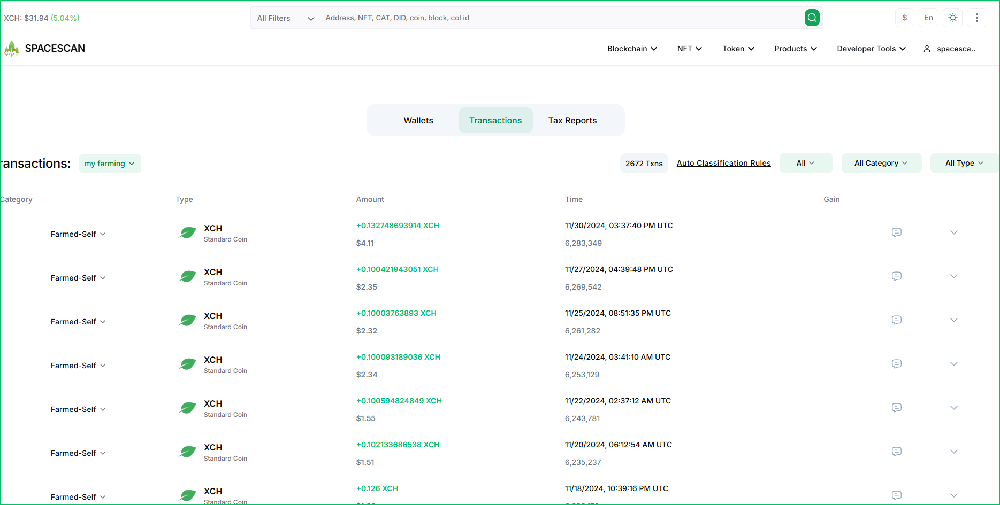
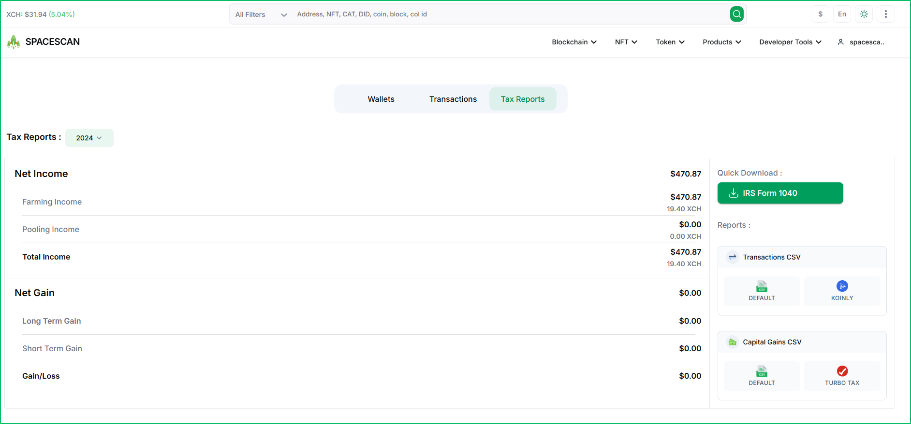
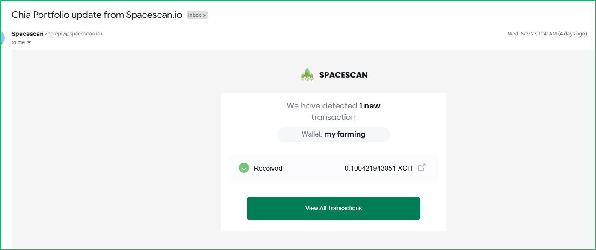

# Chia Tax Statement

This guide will help you understand how to use Spacescan.io's tax reporting features to track and manage your Chia blockchain transactions for tax purposes.

## Overview

Spacescan.io provides comprehensive tax reporting tools that help you:

- Track farming income and rewards
- Monitor capital gains/losses
- Generate IRS-compatible tax reports
- Export transaction history in various formats
- Receive automated tax-related notifications

## Getting Started

### Step 1: Access Tax Reports

Navigate to the Tax Reports section:

1. Log into your Spacescan.io account
2. Click on "Wallets" in the main navigation
3. Select the "Tax Reports" tab



### Step 2: Configure Your Wallet

Add your wallet information to begin tracking:

1. Click the "Add Wallet" button
2. Fill in the required details:
   ```
   - Wallet Name: Choose a recognizable name
   - Master Public Key: Your wallet's public key
   - Currency: Select your preferred currency (e.g., USD)
   - Number Format: Choose your preferred format
   - Non Observer Addresses (optional)
   ```



## Transaction Monitoring

### Viewing Transaction History

Monitor all your transactions in one place:

1. Select your wallet from the dropdown menu
2. View detailed transaction information:
   - Transaction type and category
   - Amount and timestamp
   - Gain/Loss calculations
   - Transaction status



### Understanding Transaction Categories

Transactions are categorized as:
- **Farming Income**: Rewards from farming
- **Pooling Income**: Rewards from pool farming
- **Trading**: Buy/sell transactions
- **Transfers**: Wallet-to-wallet movements

## Tax Report Generation

### Available Reports

The platform offers several types of tax reports:



1. **Net Income Reports**
   - Farming income summary
   - Pooling income details
   - Total income calculations

2. **Capital Gains Reports**
   - Long-term gains/losses
   - Short-term gains/losses
   - Aggregate gain/loss summary

### Downloading Reports

Export your tax information in multiple formats:

1. **IRS Form 1040**
   - Quick download for official filing
   - Pre-formatted for tax submission

2. **Transaction Reports**
   - DEFAULT format for general use
   - KOINLY compatible format for tax software

3. **Capital Gains Reports**
   - DEFAULT format with detailed calculations
   - TURBO TAX compatible format

## Automated Notifications

Stay updated with automated email notifications:

- Transaction alerts
- Report generation confirmations
- Tax deadline reminders
- Important updates and changes



## Best Practices

1. **Regular Updates**
   - Keep your wallet information current
   - Monitor transactions frequently
   - Download reports periodically

2. **Record Keeping**
   - Store downloaded reports securely
   - Maintain backup copies
   - Document any manual adjustments

3. **Compliance**
   - Verify tax calculations
   - Consult with tax professionals
   - Stay informed about regulations

## Tips and Recommendations

:::tip Regular Monitoring
Check your tax reports monthly to ensure accurate tracking and avoid end-of-year surprises.
:::

:::tip Professional Consultation
While our tools provide comprehensive reporting, we recommend consulting with a tax professional for specific advice about your situation.
:::

:::warning Important Note
Tax regulations vary by jurisdiction. Ensure you understand your local tax requirements and maintain appropriate records.
:::

## Support and Resources

If you need assistance with tax reporting:

1. Check our FAQ section
2. Contact our support team
3. Review our tax documentation
4. Consult the Chia Network tax guidelines

## Next Steps

After setting up tax reporting:

1. Configure automated notifications
2. Schedule regular report downloads
3. Set up backup procedures
4. Review transaction categorization

For additional help or feature requests, please contact our support team. 