# Chia Tax Statements

## 1) For Chia farmers / Traders who started with/after Chia version 1.3

If you began farming Chia with or after version 1.3, it is likely that you are using observer keys. The new version of the Chia client uses observer keys by default, which allow for public derivation. The main advantage of observer keys is the ability to support read-only wallets.

1. First, visit the  [**Chia Tax page in spacescan.io**](https://www.spacescan.io/statements)
2. Enter the public key from GUI or Master key from CLI (chia keys show)
    - **Chia wallet GUI**:

        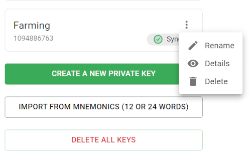

        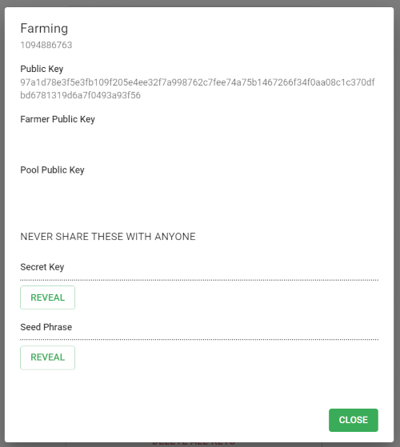

    - **Chia CLI**:
        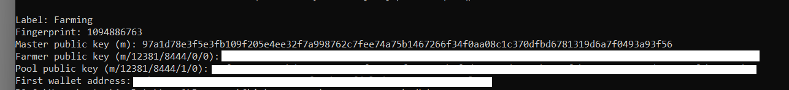

3. Select the start and end dates, as well as the desired currency, and click on the "calculate" button.
4. The report will be generated in a few minutes. Please note that the report generation time will depend on the number of transactions associated with the provided address.
    
    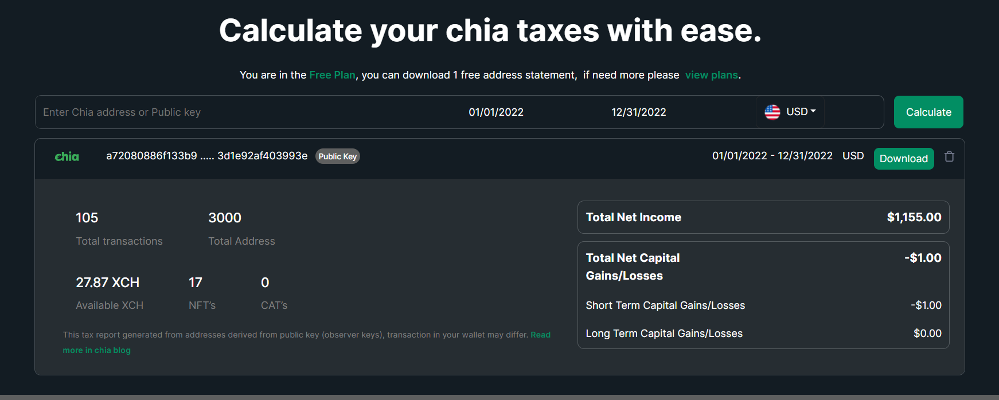

    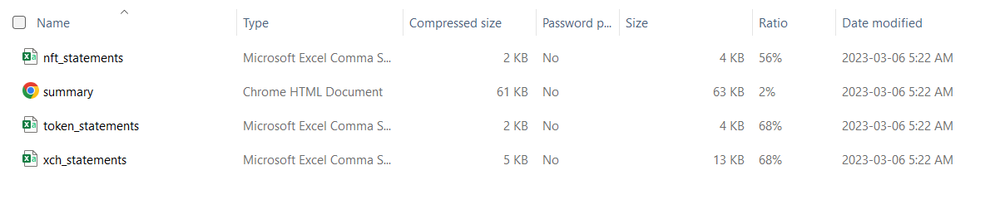

    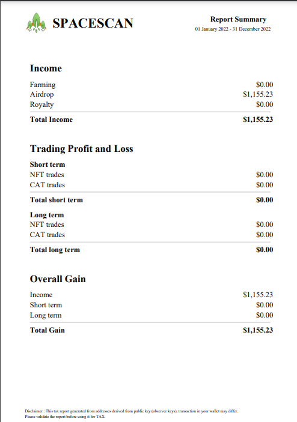

    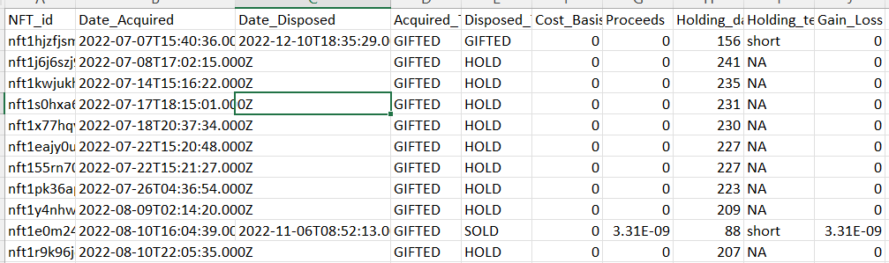

## 2) For Chia farmers who started farming before Chia version 1.3

If you started farming Chia before version 1.3, then it is likely that you are using a hardened key, which requires the use of an XCH address to generate a statement for that key. Prior versions of the Chia client utilized non-observer wallet keys, which although secure, presented a drawback. Namely, a parent public key could not be used to derive a child public key, rendering read-only wallets impossible with Chia's old keys.

To generate your tax statement, please follow these steps:

1. First, visit the  [**Chia Tax page in spacescan.io**](https://www.spacescan.io/statements)
2. Enter the XCH address that you used to receive your farming rewards.

    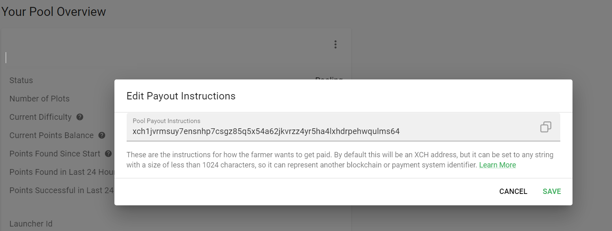

3. Select the start and end dates, as well as the desired currency, and click on the "calculate" button.

    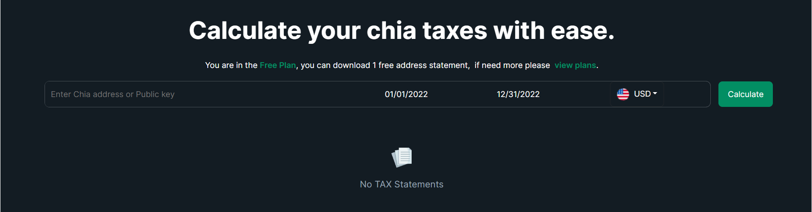

    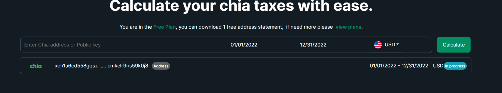

4. The report will be generated in a few minutes. Please note that the report generation time will depend on the number of transactions associated with the provided address.
    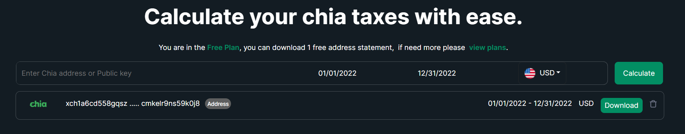

    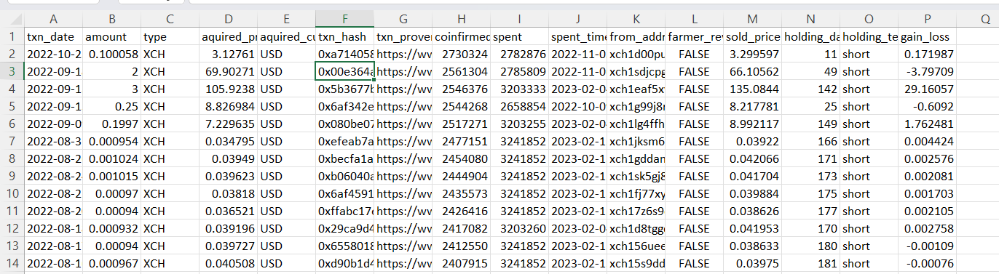

## 3) To pay in XCH using wallet connect, follow these steps:

1. log in to spacescan using your email ID and Select the plan.

    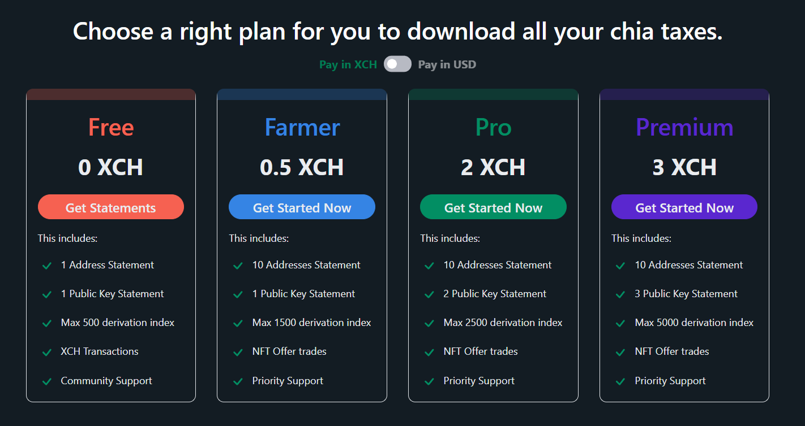

2. A QR code will appear, Click on the "COPY TO CLIPBOARD" link at the bottom of the code.

    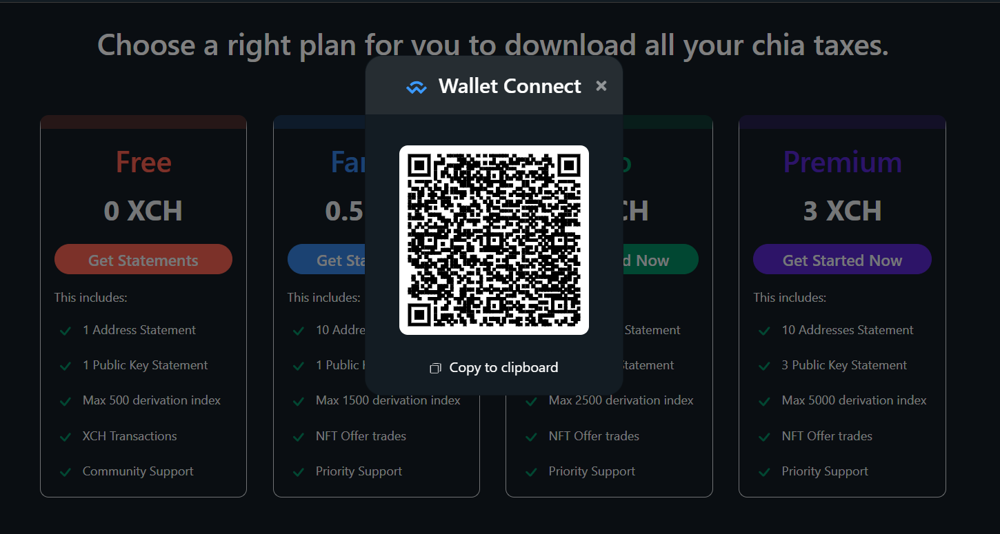
3. Open your Chia wallet and select the wallet connect option.

    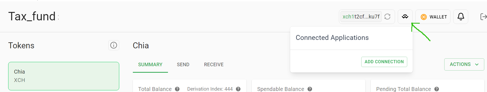
4. Click "Add connection" and paste the wallet connect string as shown below and Click "Continue".

    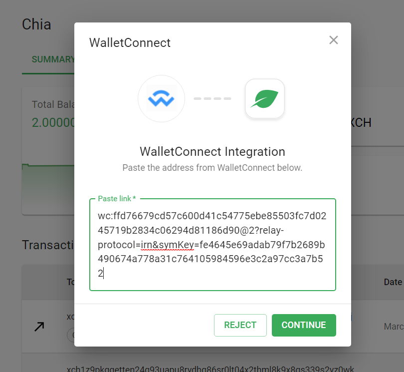
5. Once connected, refresh the price plan page in Spacescan and click on the "Pay" option.

    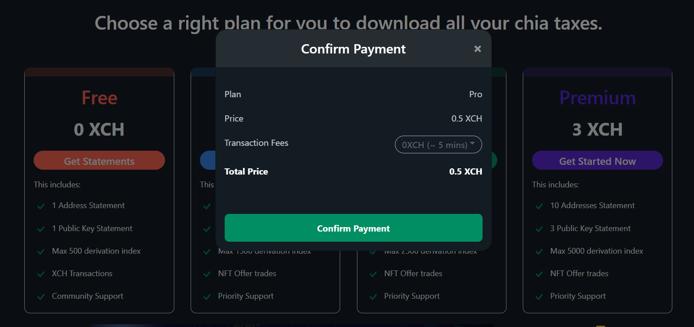
6. Select the transaction fee and confirm payment.

    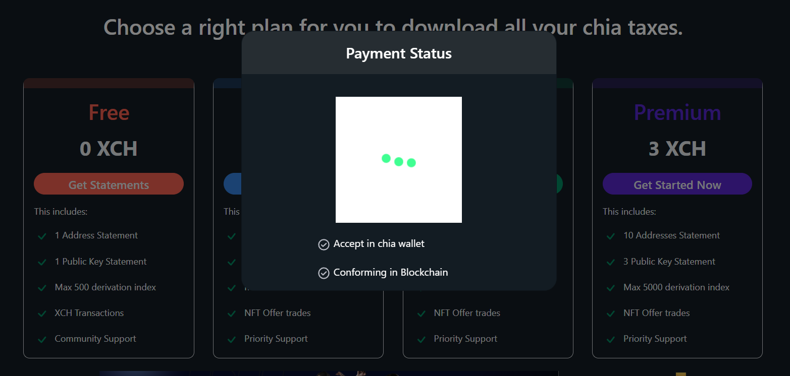
7. Approve the payment in your Chia wallet.

    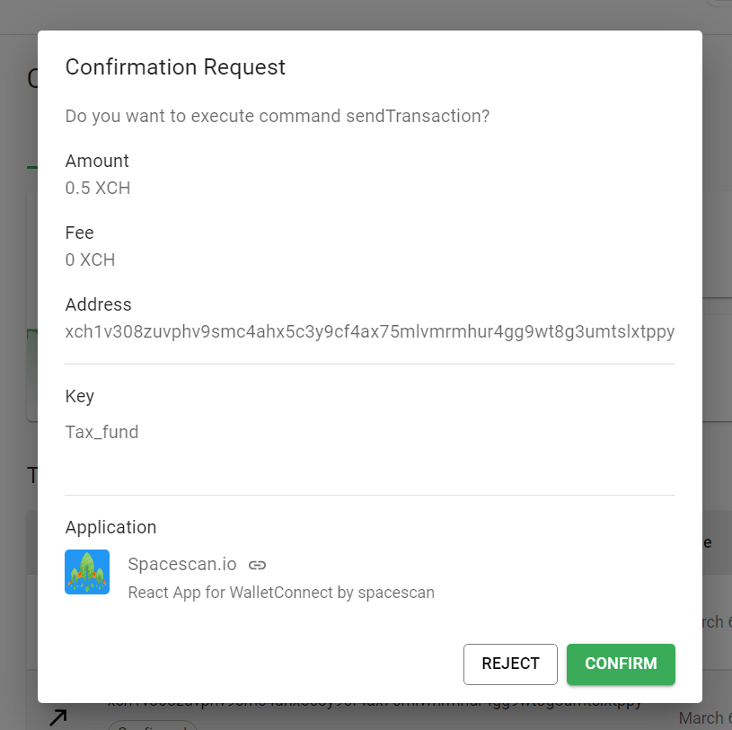
8. Wait for confirmation from the blockchain, then click on "Done".

    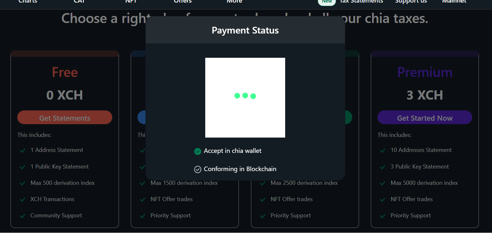
9. The page will load with your purchased plan.

    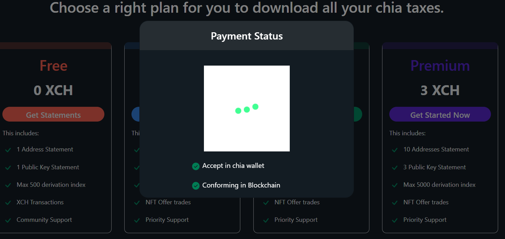

    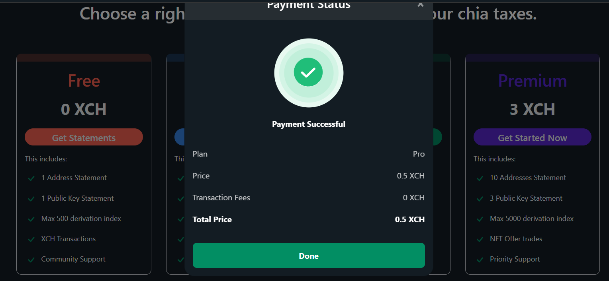
