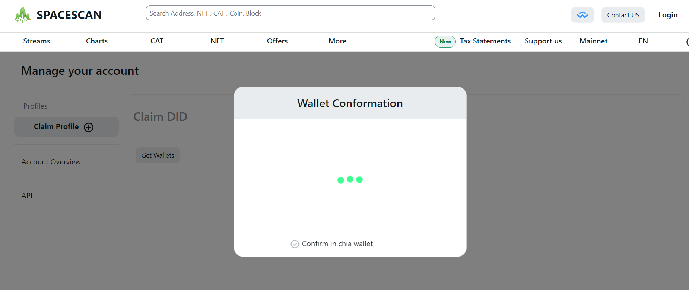

# Chia DID Profile

We are excited to introduce the new Chia DID profile in Spacescan. This guide will walk you through the process of setting up a Chia DID profile using wallet connect. This process will enable the digital identity to be securely managed and shared with others on the Chia community. 

In the near future, this DID profile has the potential to serve as Provence for various assets on the Chia blockchain, as well as a means of verifying social identities across different platforms.

** This feature still in Beta so expect some glitches. [Reach team here for support](https://www.spacescan.io/contact-us) **

### 1) Create a DID profile from Chia wallet

### 2) Goto [**myprofile in spacescan.io**](https://www.spacescan.io/myprofile)

### 3) Click on "Get Wallets" button and it opens wallet connect code.  

### 4) Connect Chia wallet with Spacescan using the copied connect code

### 5) Once connected, Click again "Get Wallets" to Fetch the DID profileS from Chia wallet.

### 6) Claim a DID by signing with selected DID.

### 7) Customize your DID profile

### 8) Customize your Collection created by claimed DID

