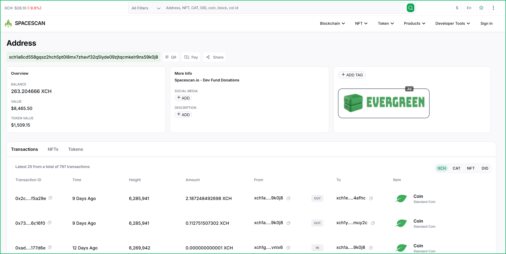
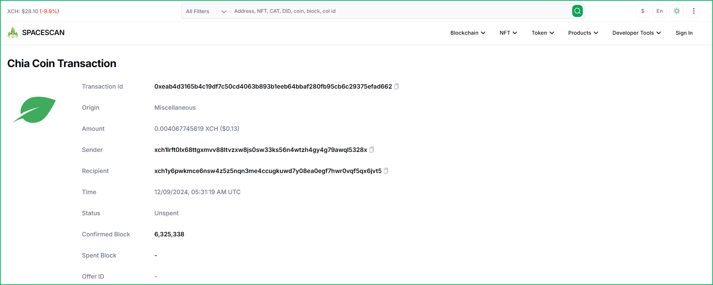
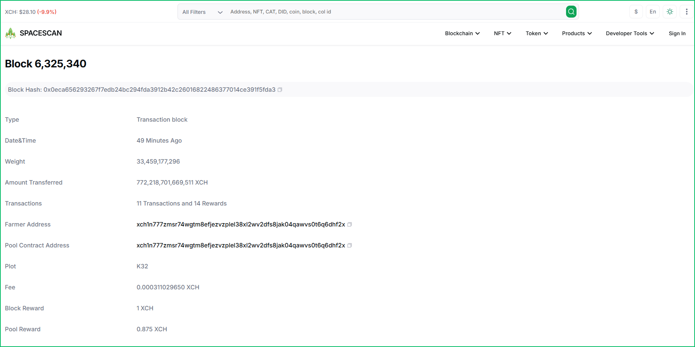
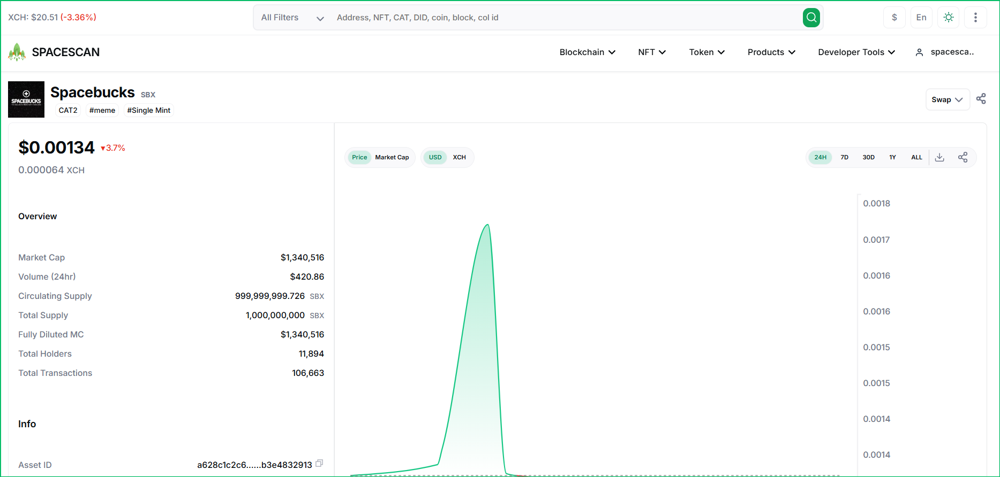

# Exchange Integration

SpaceScan.io is the leading Chia blockchain explorer, recognized by Chia.net and its [ecosystem](https://xch.network/ecosystem/), and seamlessly integrated into Chia’s native wallets. Offering exceptional reliability, high availability, and comprehensive API support, we provide exchanges with the most dependable solution to:

- Track transactions and balances in real-time
- Verify blockchain data with confidence
- Provide users with easy access to transaction history

This guide explains how to integrate Spacescan.io links into your exchange platform to provide users with detailed information about Chia (XCH) addresses, transactions, and blocks.

## Address Explorer Integration

You can link any XCH address to Spacescan.io by appending the address to the base URL:

```
https://www.spacescan.io/address/{xch_address}
```

### Example
```
https://www.spacescan.io/address/xch1a6cd558gqsz2hch5pt0l8mx7zhavf32q5lyde09zjtqcmkelr9ns59k0j8
```



The address explorer shows:
- Current balance
- Transaction history
- Incoming/outgoing transactions
- NFT holdings
- CAT token balances

## Transaction Explorer Integration

To link to transaction details, append the transaction/coin ID to the base URL:

```
https://www.spacescan.io/coin/{transaction_id}
```

### Example
```
https://www.spacescan.io/coin/0x99ca7ff010b9e26176d998288006f1efcac9d84af3655a0152e0d44b5d3def1d
```



The transaction explorer shows:
- Transaction amount
- Sender and recipient addresses
- Transaction timestamp
- Block confirmation details
- Transaction status

## Block Explorer Integration

To link to block details, append the block height to the base URL:

```
https://www.spacescan.io/block/{block_height}
```

### Example
```
https://www.spacescan.io/block/6325004
```



The block explorer shows:
- Block hash
- Block timestamp
- Farmer address
- Block rewards
- Transactions in the block
- Block weight and other metadata

## Token Explorer Integration

To link to token details, you can use either the token symbol or token ID:

```
https://www.spacescan.io/token/{token_symbol_or_id}
```

### Examples
```
// Using token symbol
https://www.spacescan.io/token/SBX

// Using token ID
https://www.spacescan.io/token/a628c1c2c6fcb74d53746157e438e108eab5c0bb3e5c80ff9b1910b3e4832913
```



The token explorer shows:
- Token name and symbol
- Market cap and volume
- Total and circulating supply
- Number of holders
- Recent trades and transfers
- Price charts and market data

### Token API Integration

For exchanges requiring programmatic access to token data, Spacescan.io provides comprehensive APIs:

#### 1. Get Token Information
```javascript
// Fetch basic token information, price, and supply
GET https://api.spacescan.io/token/info/{token_id}

// Example Response
{
  "status": "success",
  "info": {
    "asset_id": "token_id",
    "name": "Token Name",
    "symbol": "SYMBOL",
    "description": "Token description...",
    "type": "CAT2"
  }
}
```

#### 2. Get Total Supply
```javascript
GET https://api.spacescan.io/token/total-supply/{token_id}

// Example Response
{
  "total_supply": 1000000000
}
```

#### 3. Get Circulating Supply
```javascript
GET https://api.spacescan.io/token/circulating-supply/{token_id}

// Example Response
{
  "circulating_supply": 999999999
}
```

For detailed API documentation, implementation examples, and advanced usage, please refer to:
- [Token Info API Documentation](https://docs.spacescan.io/api/cat/info)
- [Total Supply API Documentation](https://docs.spacescan.io/api/cat/total-supply)
- [Circulating Supply API Documentation](https://docs.spacescan.io/api/cat/circulating-supply)

## Implementation Examples

### HTML Link
```html
<!-- Address Link -->
<a href="https://www.spacescan.io/address/xch1a6cd558gqsz2hch5pt0l8mx7zhavf32q5lyde09zjtqcmkelr9ns59k0j8" target="_blank">
  View on Spacescan
</a>

<!-- Transaction Link -->
<a href="https://www.spacescan.io/coin/0x99ca7ff010b9e26176d998288006f1efcac9d84af3655a0152e0d44b5d3def1d" target="_blank">
  View Transaction
</a>

<!-- Block Link -->
<a href="https://www.spacescan.io/block/6325004" target="_blank">
  View Block
</a>
```

### JavaScript
```javascript
function getSpacescanUrl(type, id) {
  const baseUrl = 'https://www.spacescan.io';
  
  switch(type) {
    case 'address':
      return `${baseUrl}/address/${id}`;
    case 'transaction':
      return `${baseUrl}/coin/${id}`;
    case 'block':
      return `${baseUrl}/block/${id}`;
    default:
      throw new Error('Invalid type');
  }
}

// Usage
const addressUrl = getSpacescanUrl('address', 'xch1a6cd558gqsz2hch5pt0l8mx7zhavf32q5lyde09zjtqcmkelr9ns59k0j8');
const txUrl = getSpacescanUrl('transaction', '0x99ca7ff010b9e26176d998288006f1efcac9d84af3655a0152e0d44b5d3def1d');
const blockUrl = getSpacescanUrl('block', '6325004');
```

## Best Practices

1. Always open Spacescan links in a new tab using `target="_blank"` to preserve the user's exchange session.

2. Include tooltips or labels to clearly indicate that the link will take users to Spacescan.io.

3. Consider adding the Spacescan logo next to explorer links for better user recognition.


## Support

For technical support or questions about integration, please contact:
- Email: support@spacescan.io
- Discord: [Join Spacescan Discord](https://discord.gg/spacescan)
- Twitter: [@spacescan_io](https://twitter.com/spacescan_io)