# Chia Address Profile

We are excited to introduce the new Chia Address profile in Spacescan. This guide will walk you through the process of setting up a Chia Address profile using wallet connect. This process will enable the digital identity to be securely managed and shared with others on the Chia community. 

In the near future, this Address profile has the potential to serve as Provence for various assets on the Chia blockchain, as well as a means of verifying social identities across different platforms.

:::caution Beta feature
This feature is still in Beta, so expect some rough edges. [Reach the team here for support](https://www.spacescan.io/contact-us).
:::

**The chia wallet should connect with spacescan.io before claim the address.If already connected with spacescan.io , just jump to step:4**

### 1) In the browser go to [**spacescan.io**](https://www.spacescan.io/) and click on "Connect Wallet" button and a pop up with QR code opens.

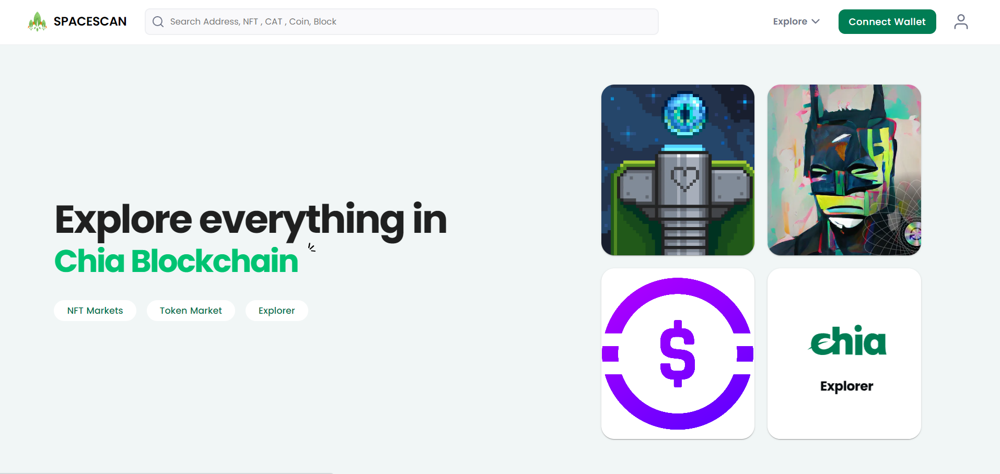

Click "Copy to clipboard"

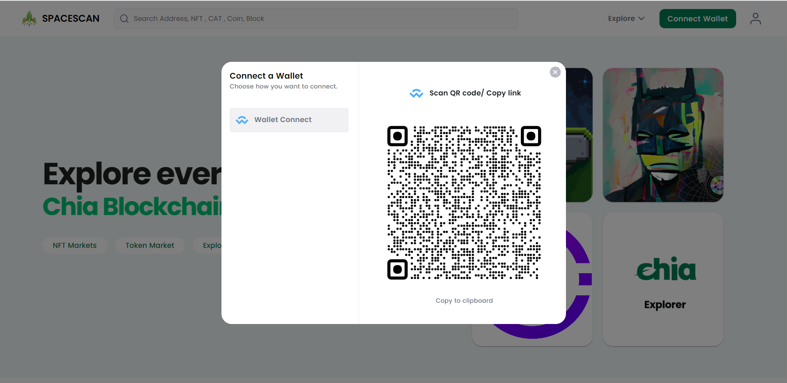

### 2)  Open Chia Wallet and click on the wallet connect symbol to add connection

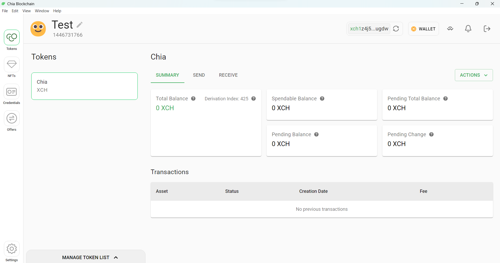

Click "Add connection"

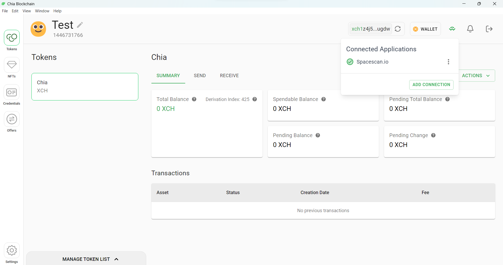

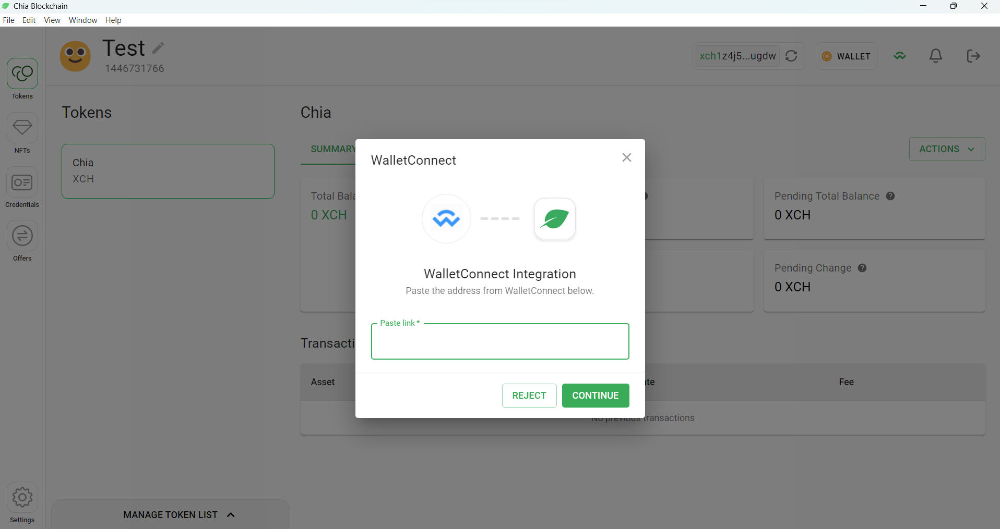

### 3) Click on "Copy to clipboard" and paste it in the chia Wallet Connect and click on "Continue" to establish the connection

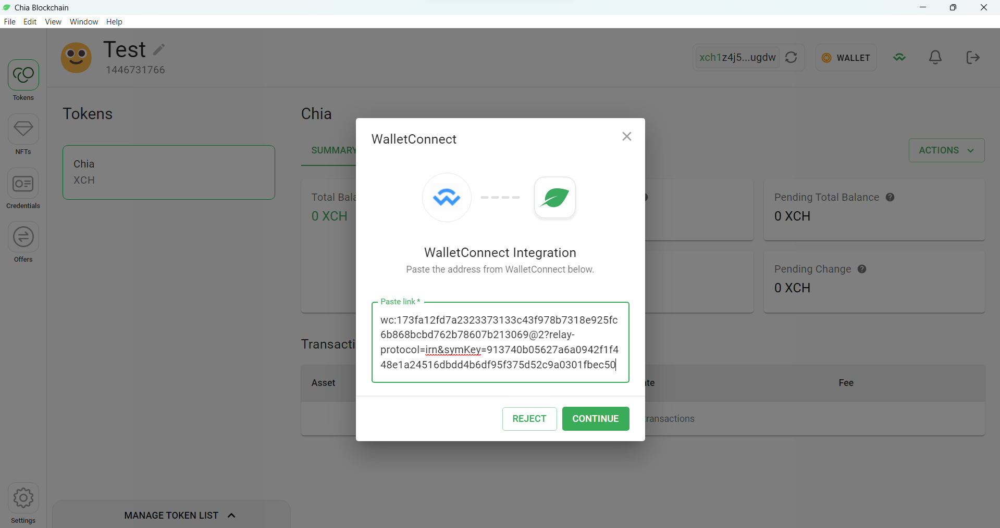

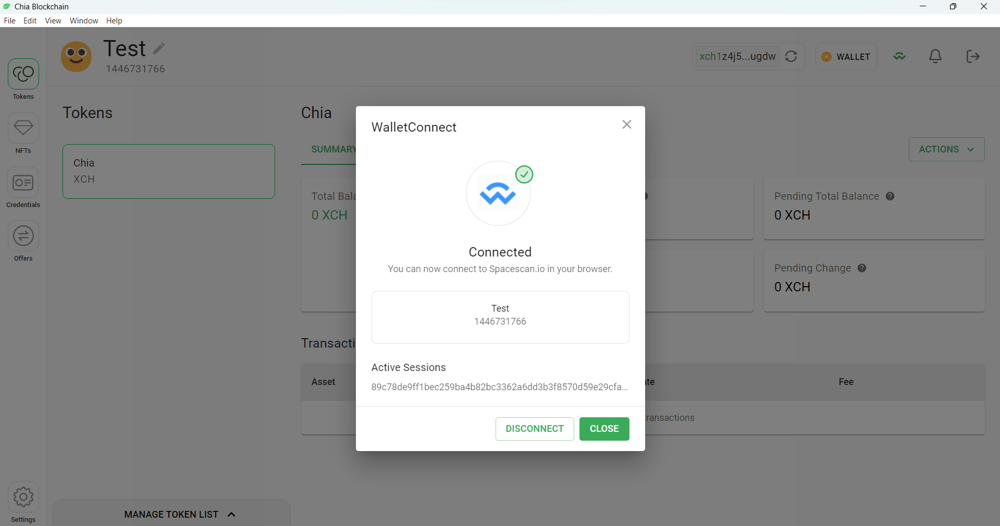

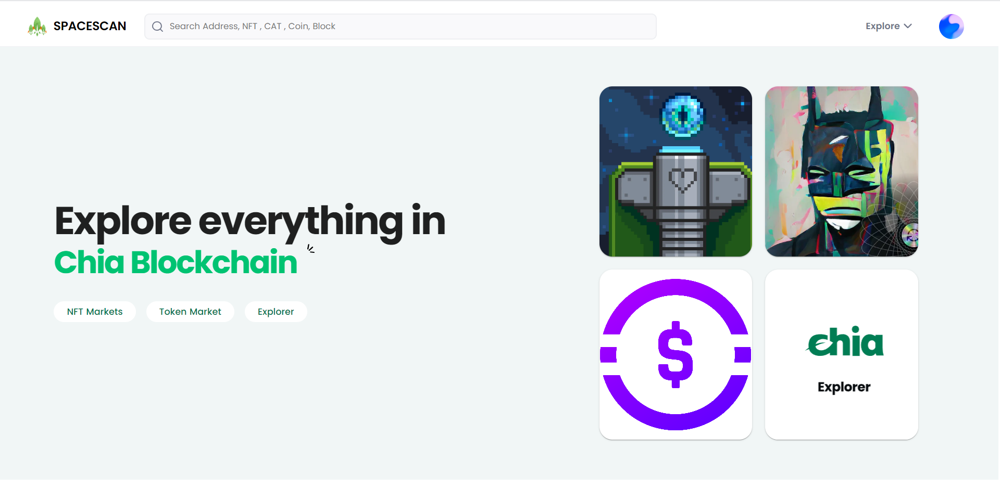

### 4) In the website click on the profile icon and choose "Address Profile"

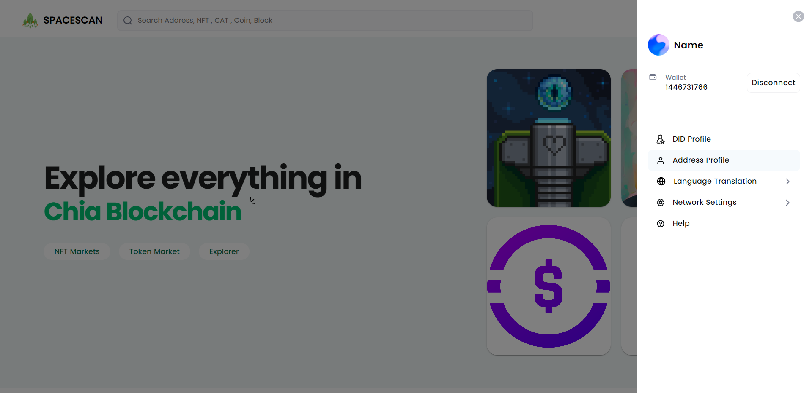

Click "Add address profile" button.

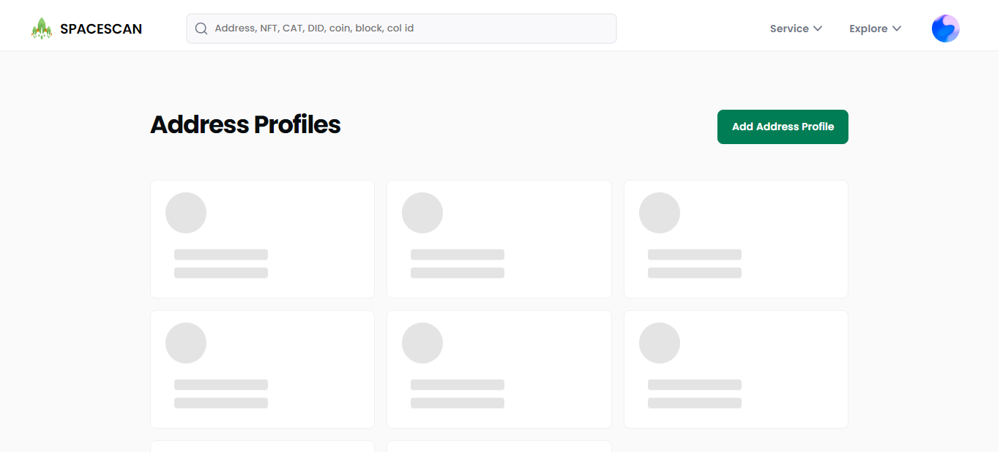

### 5) Copy the address from the chia wallet and paste it in the spacescan website to claim the address

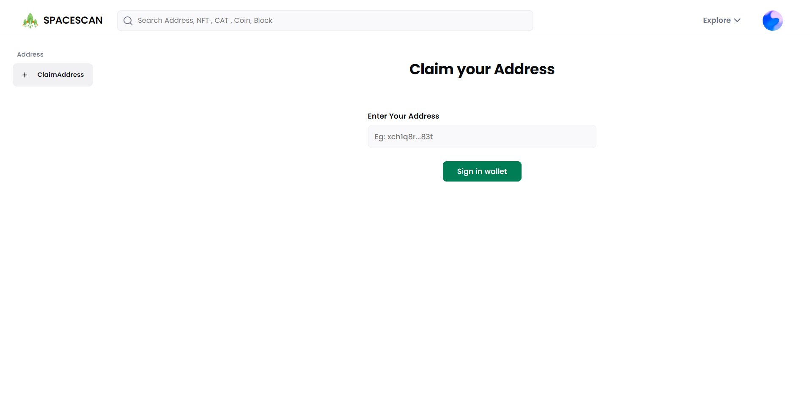

### 6) Click on "Sign in wallet" and confirm the request in the chia wallet

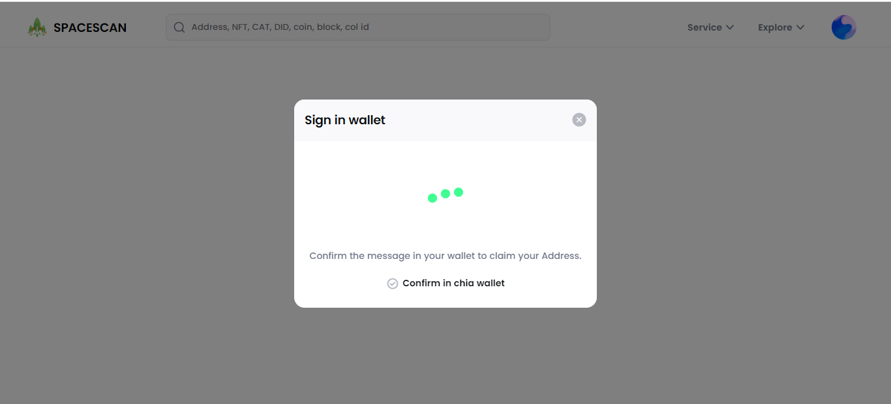

Hit the confirm button 

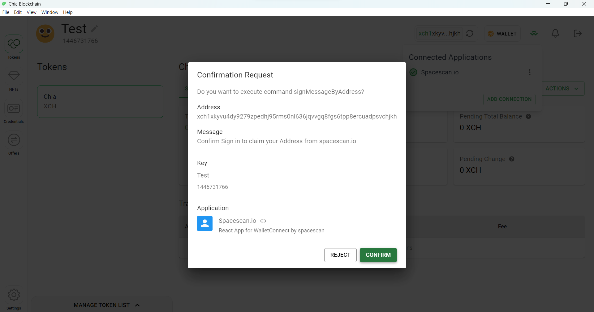

### 7)  "Edit profile" to customize the profile
After address claimed the user will land on the address edit page

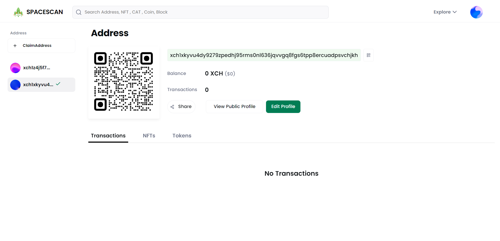
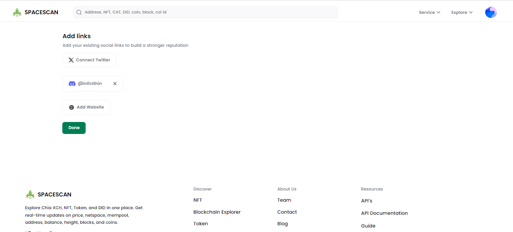

### 8) To view the public profile
After edit ,you can see the claimed address.

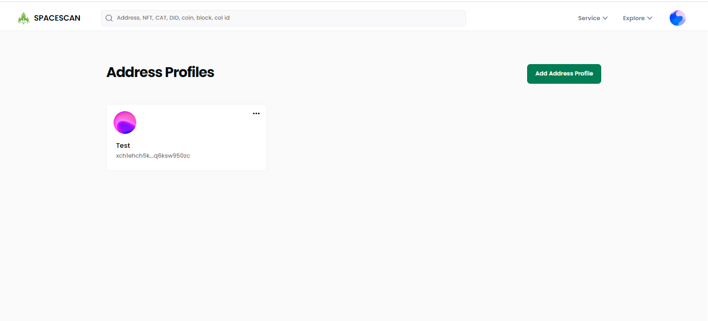
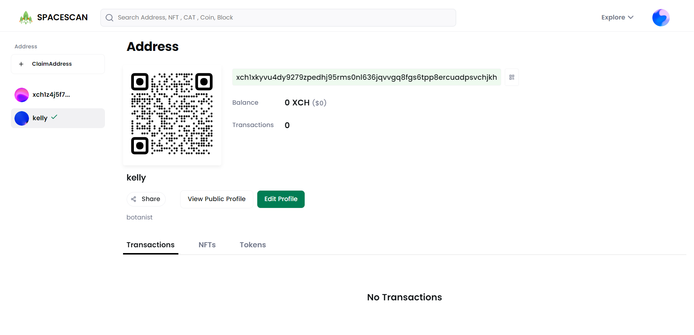
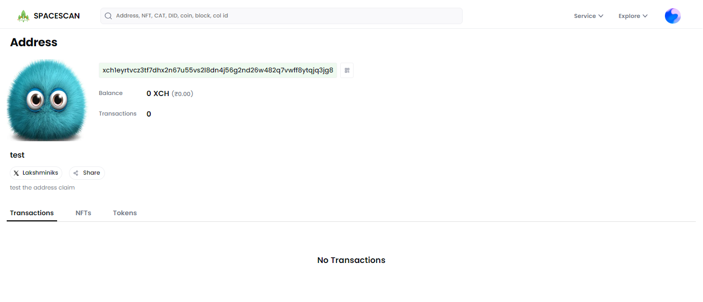
