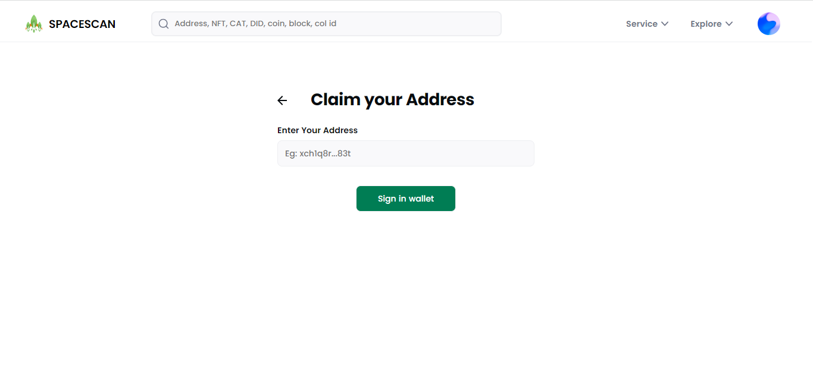
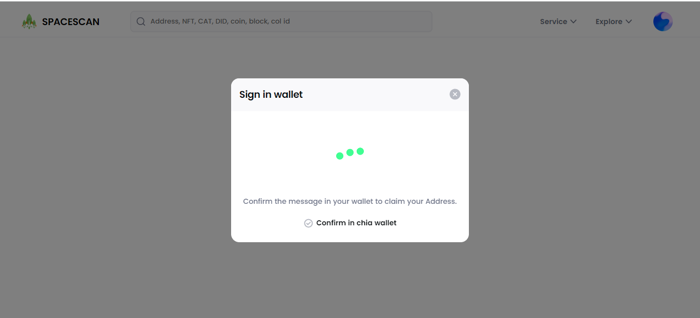
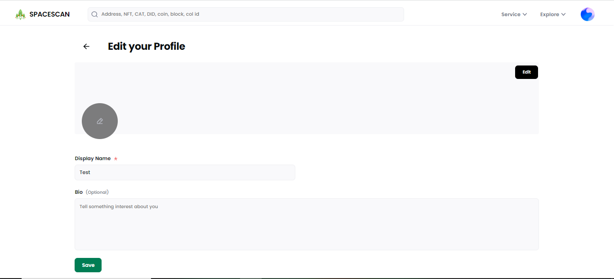
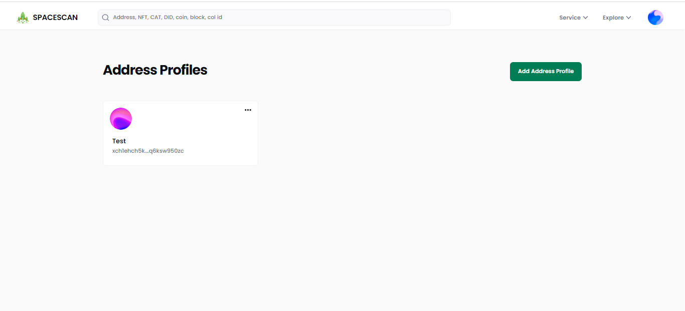
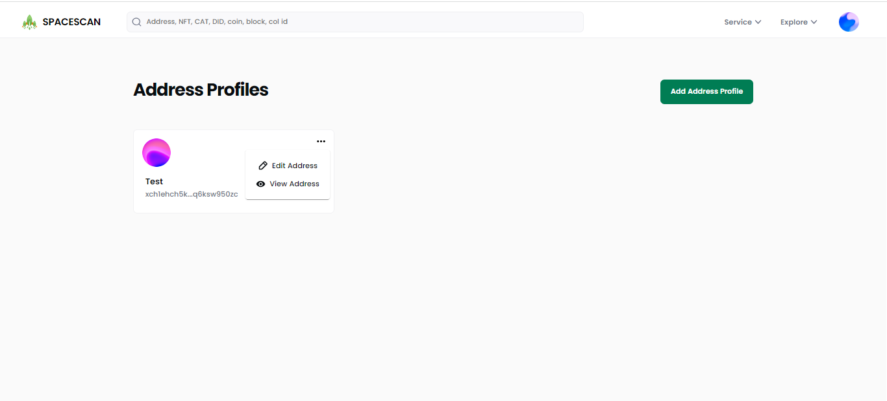
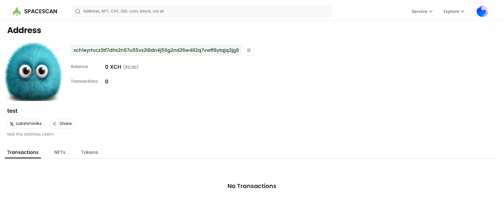

# Chia Address Profile

We are excited to introduce the new Chia Address profile in Spacescan. This guide will walk you through the process of setting up a Chia Address profile using wallet connect. This process will enable the digital identity to be securely managed and shared with others on the Chia community. 

In the near future, this Address profile has the potential to serve as Provence for various assets on the Chia blockchain, as well as a means of verifying social identities across different platforms.

** This feature still in Beta so expect some glitches. [Reach team here for support](https://www.spacescan.io/contact-us) **

### 1) Open Chia Wallet and click on the wallet connect symbol to add connection

### 2) In the browser go to [**spacescan.io**](https://www.spacescan.io/) and click on "Connect Wallet" button and a pop up with QR code opens.

### 3) Click on "Copy to clipboard" and paste it in the chia Wallet Connect and click on "Continue" to establish the connection

### 4) In the website click on the profile icon and choose "Address Profile"

### 5) Copy the address from the chia wallet and paste it in the spacescan website to claim the address

### 6) Click on "Sign in wallet" and confirm the request in the chia wallet

### 7) Click on "Edit profile" to customize the profile

### 8) Click on "Share" to share the profile link and "View public profile" to view the profile being displayed

