# Wallet Monitor

This guide covers the wallet monitor built into the Spacescan explorer. It tracks an address or public key and sends E-Mail alerts, plus a notification table inside Spacescan.

:::tip Looking for cold-storage monitoring?
**SpaceScan Wallets** ([wallets.spacescan.io](https://wallets.spacescan.io)) is the newer, dedicated product for this — it discovers every address from a master public key automatically and adds per-wallet alert rules. Start with [Watch a cold wallet and get email alerts](../wallet_security/cold_wallet_alerts.md).
:::

:::caution Beta feature
This feature is still in Beta, so expect some rough edges. [Reach the team here for support](https://www.spacescan.io/contact-us).
:::
### 1) Select the "Monitor wallet" menu and create new account 

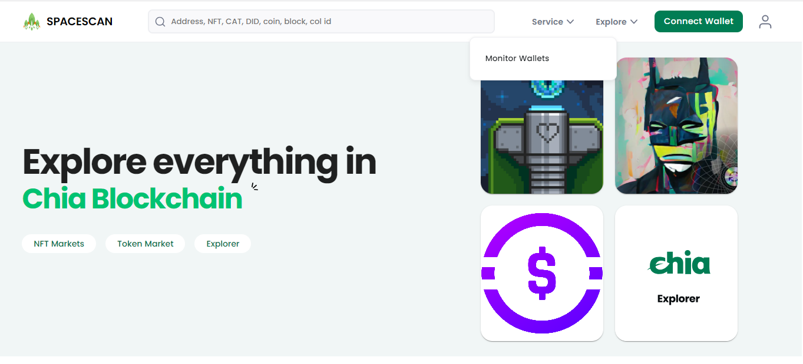

 Click sign up to create new account or choose sign in for existing user

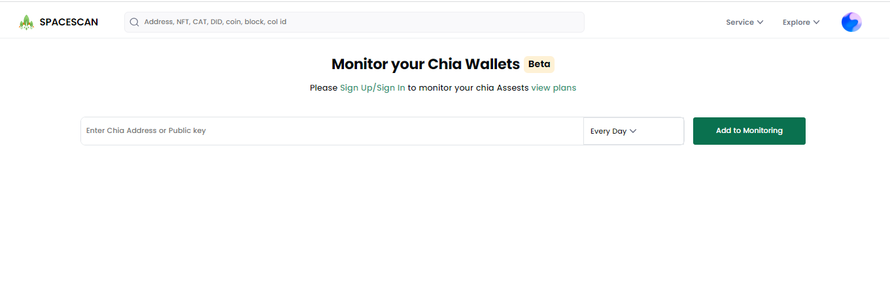

Enter the E-mail address and password to create a new account.

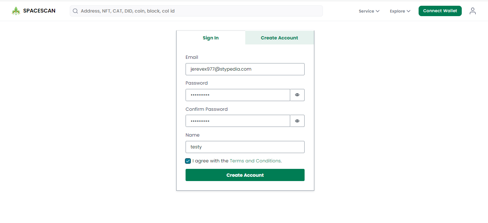

Enter the confirmation code which is sent by spacescan.

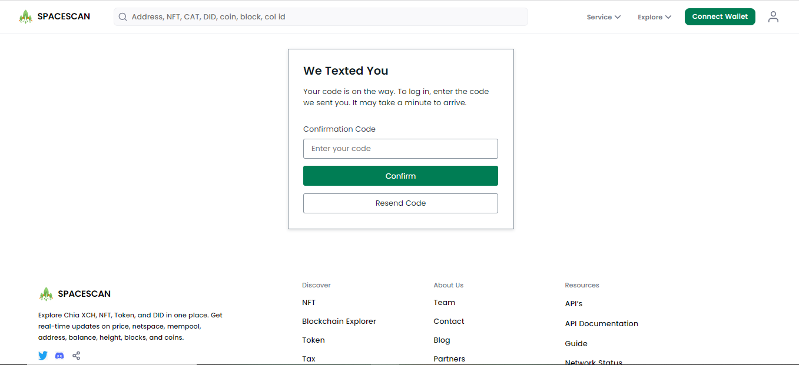

### 2) Enter the address/public key to monitor the transactions 
The new user only can access the "starter plan",Enter your address which you want to track it's transaction
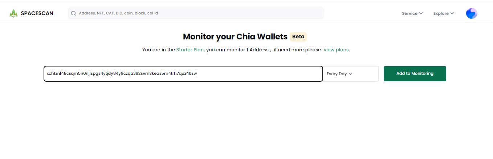

Click "Add monitor" to add your address in the tracking list.

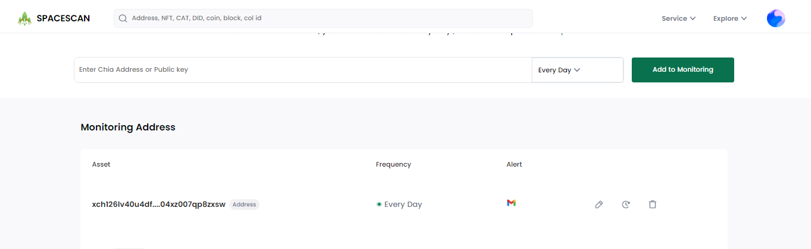

### 3)Edit the details
Based on the edited details, the user will receives the alerts

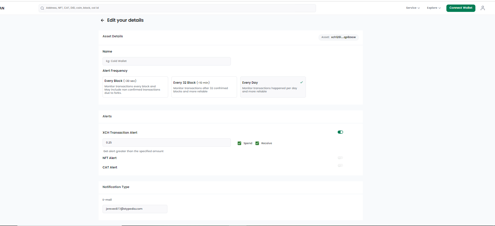

### 4)Change the plan 
 User can upgrade the plan through "view plan".According to the plan user can avail more options in the wallet monitor.

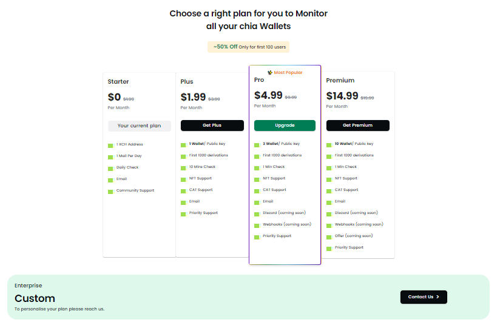

Fill the details and pay to upgrade the plan.

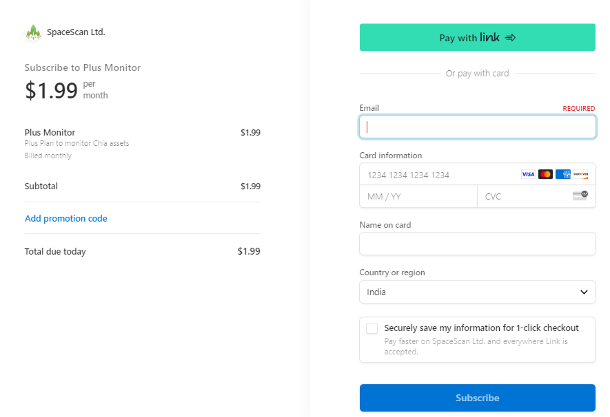

### 5)Getting public key from the wallet
Do the following steps to get the public key from the chia wallet

Click kebab icon in the wallet then select "Details"

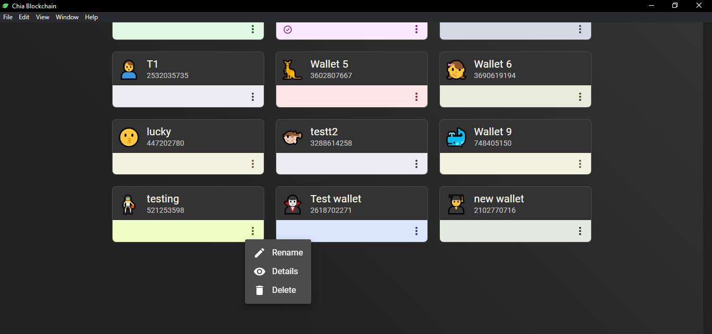

Copy the public key from the pop up window 

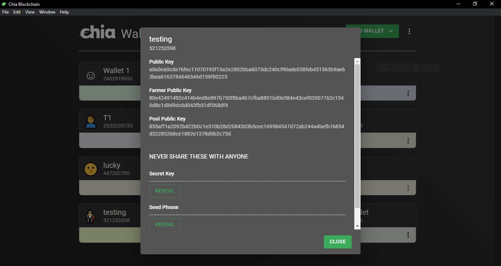

### 6)Upgraded plan and notification
According to the user's upgraded plan, the number of public key/addresses can be add.The alerts will receive through the E-mail for the transactions happens in the monitoring public key/address.

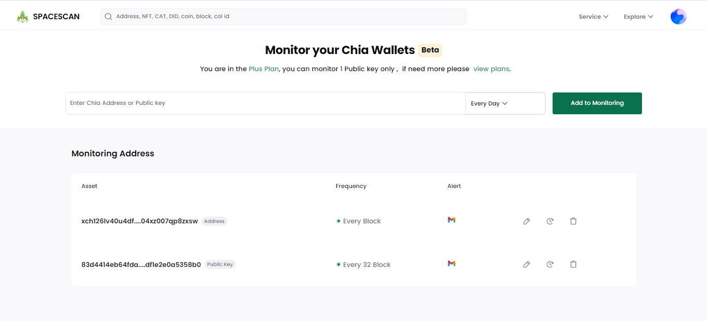

From the notification table ,can track the transactions happens in the monitoring wallet.

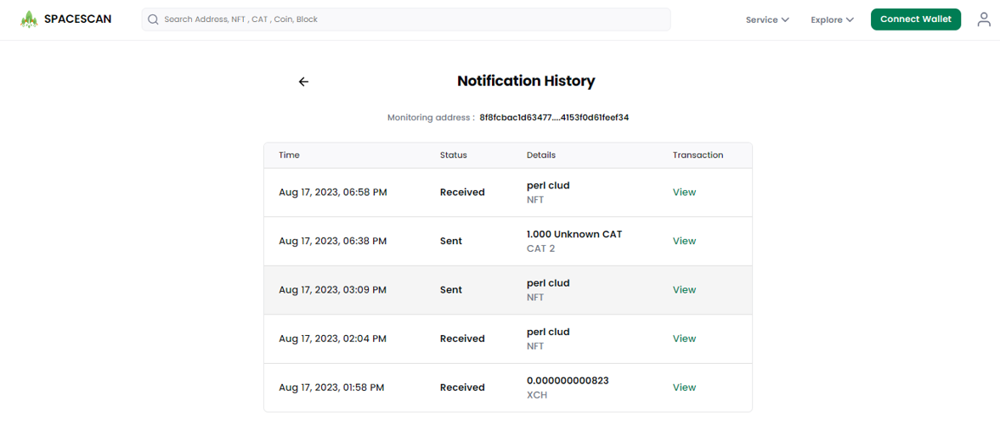

Registered E-mail address will receive the alert like as follows.

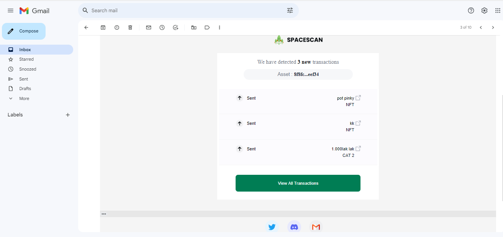

