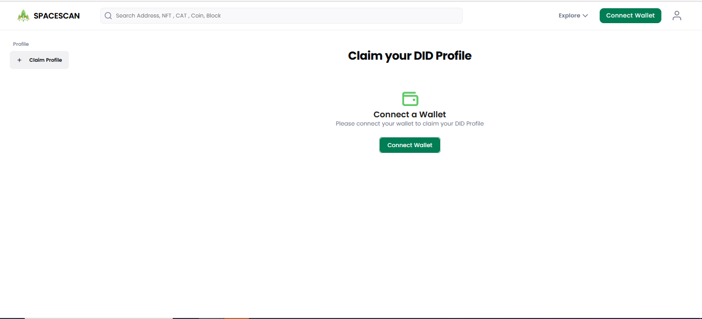

# Manage DID profile

 We are excited to introduce the new Chia DID profile in Spacescan. This guide will walk you through the process of setting up a Chia DID profile using wallet connect. This process will enable the digital identity to be securely managed and shared with others on the Chia community. 

** This feature still in Beta so expect some glitches. [Reach team here for support](https://www.spacescan.io/contact-us) **

### 1) Go to [**myprofile in spacescan.io**](https://www.spacescan.io/myprofile)
Click "connect wallet"then Popup shows QR code ,click "copy to clipboard"

### 2) Connect Chia wallet with Spacescan.io using the copied connect QR code

   
If you connected with wallet already skip the above steps and click DID profile from wallet connected icon move to chia wallet to create a DID

### 3) Create DID profile in chia wallet

### 4) Move to [**spacescan.io**](https://www.spacescan.io/myprofile) to claim the created DID
Paste the DID that you were copied from chia wallet

Confirm the DID in chia wallet

### 5) Move to spacescan.io to Edit and customize the DID
You can see the claimed DID, you can edit,customize ,view public view of your DID

### 6) Share the DID by click on the public profile in DID profile page

       
       