# Manage Token

 We are excited to introduce the new Chia Token update feature in Spacescan. This guide will walk you through the process of how to update/edit the Token details.  

:::caution Beta feature
This feature is still in Beta, so expect some rough edges. [Reach the team here for support](https://www.spacescan.io/contact-us).
:::

Before import the Token ,the chia wallet should have minted token and that chia wallet should connected with spacescan.io 
### 1)  Reach the "Token" menu from the sidebar

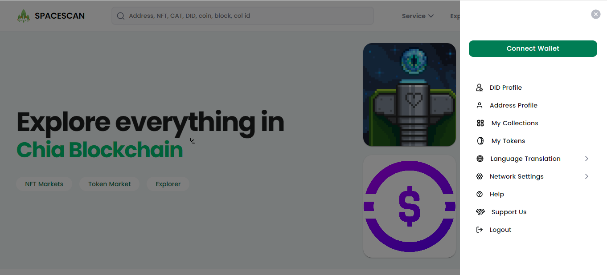

### 2)  Connect wallet to import the Token
Connect the wallet before edit/update the Token.If wallet already connected ,please skip this step and reach to the next step

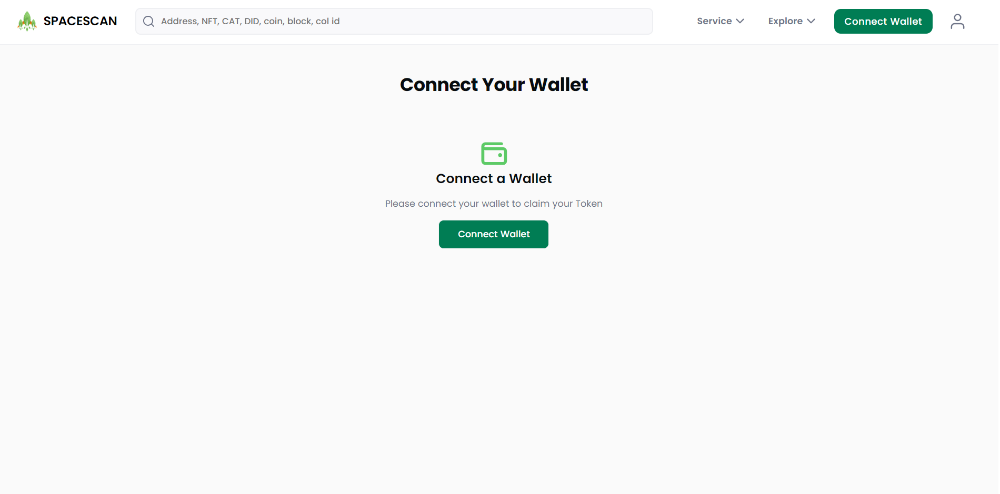

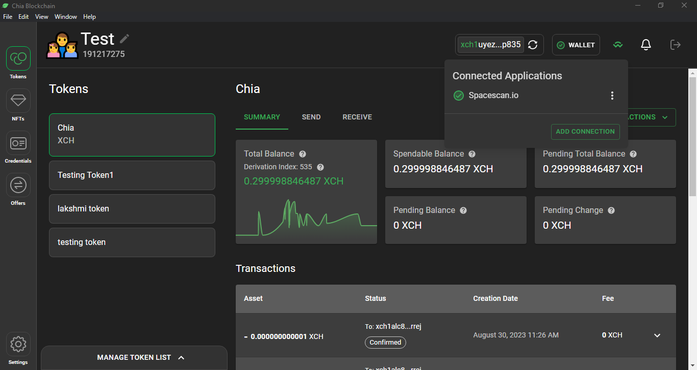

### 3) Import the Token 
After wallet connect,click the "Import Token"

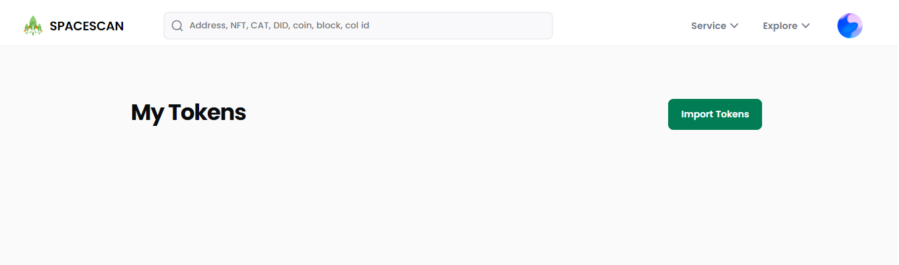

Enter the "Token ID" in the text box, which Token you want to import

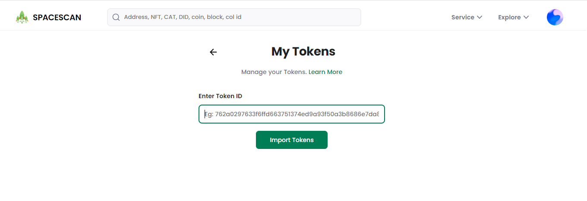

Click import Token button,It showing pop up to confirm the message in the chia wallet.

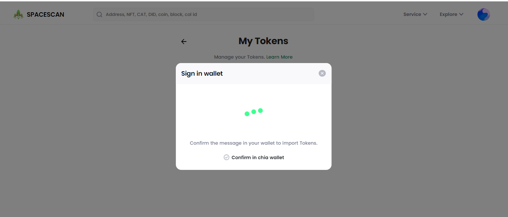

Go to the chia wallet and click confirm

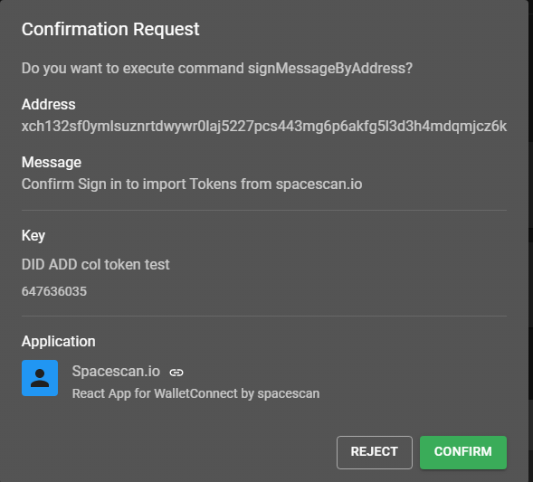

Now you can see the imported Token from your wallet

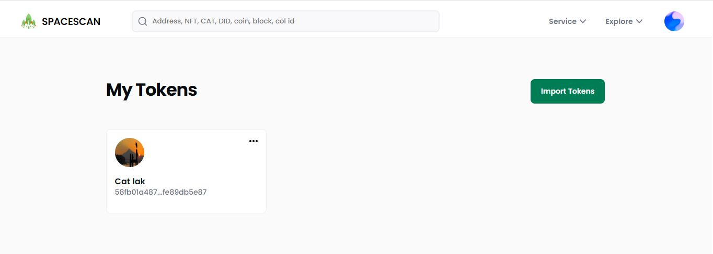

### 4) Edit/Update the Token details

Click the meat ball (3 dot) icon in up-right corner of the Token,Click edit from the menu

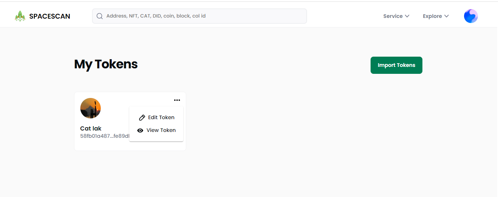

You can edit/update the Token details

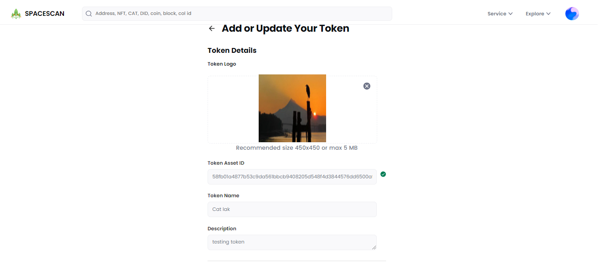

User can update/Edit the social link

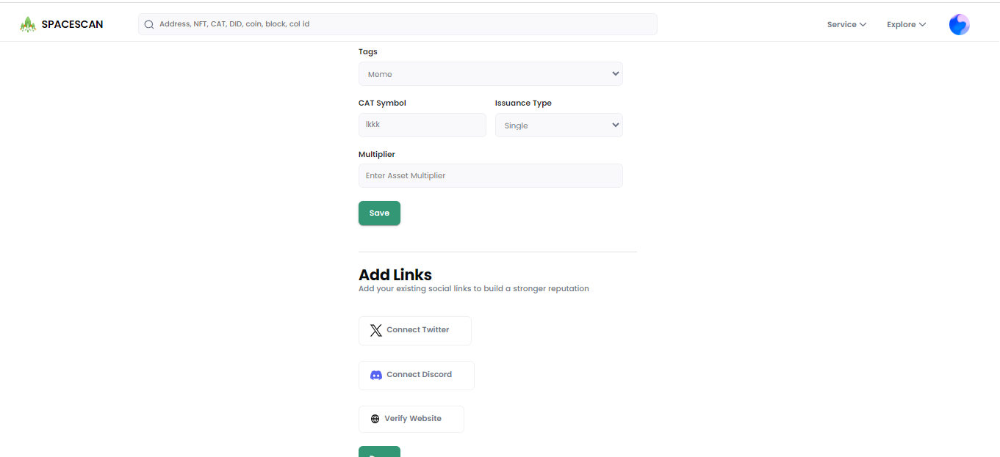
