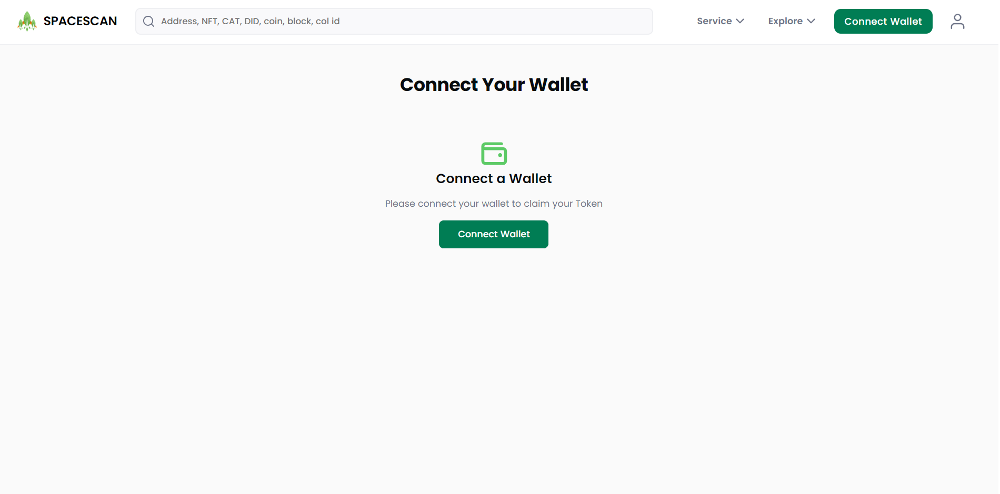

# Manage Token Details

 We are excited to introduce the new Chia Token update feature in Spacescan. This guide will walk you through the process of how to update/edit the Token details.  

** This feature still in Beta so expect some glitches. [Reach team here for support](https://www.spacescan.io/contact-us) **
### 1) Reach the "Token" menu from the sidebar

### 2)Connect wallet to import the Token
Connect the wallet before edit/update the Token.If wallet already connected ,please skip this step and reach to the next step

### 3)Import the Token 
After wallet connect,click the "Import Token"

Enter the "Token ID" in the text box, which Token you want to import

Now you can see the imported Token from your wallet

### 4)Edit/Update the Token details
Click the meat ball (3 dot) icon in up-right corner of the Token,Click edit from the menu

You can edit/update the Token details

User can update/Edit the social link

